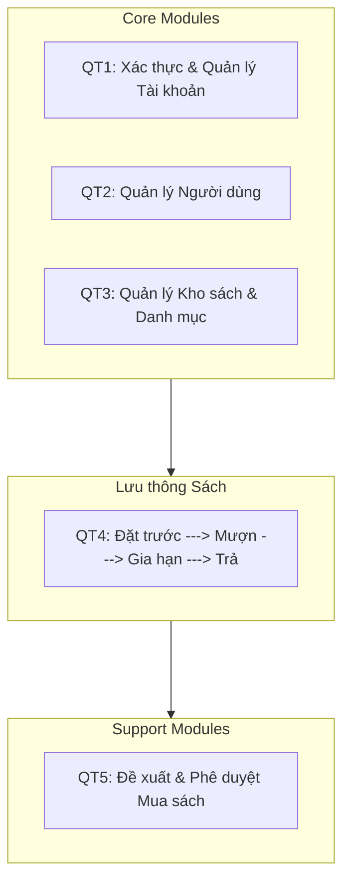
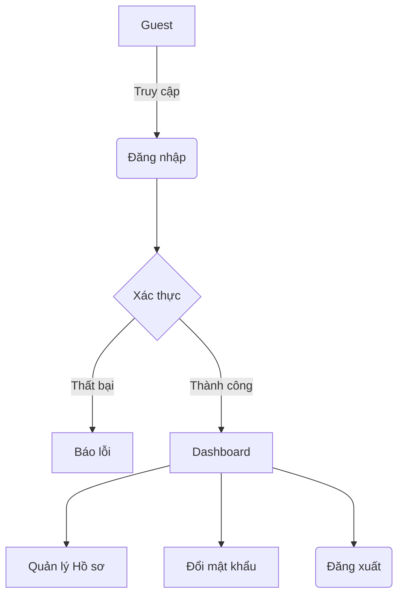
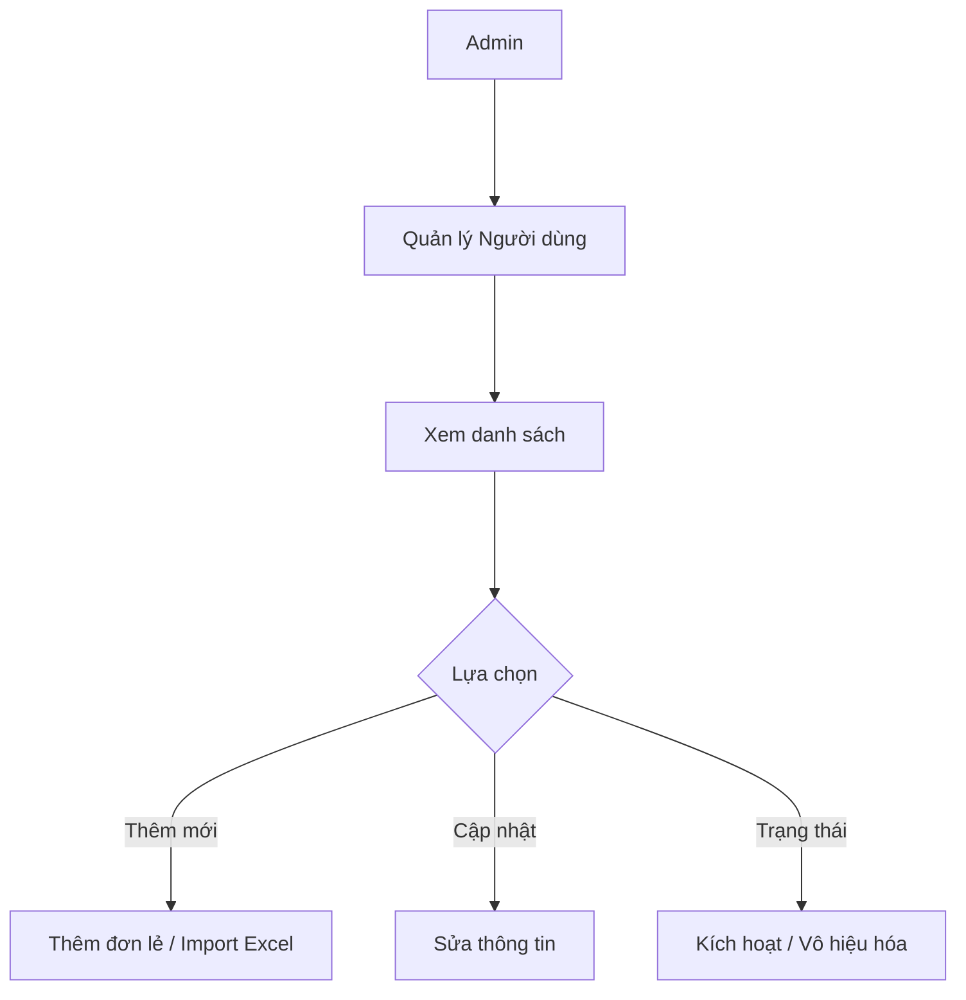
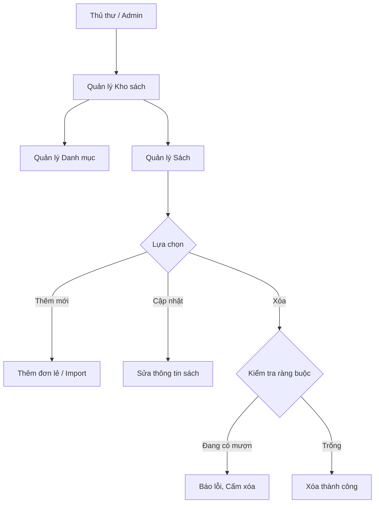
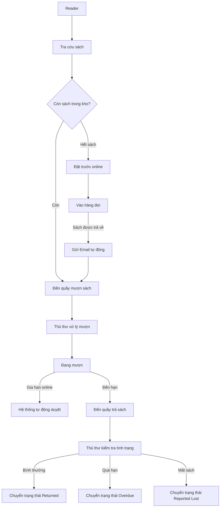
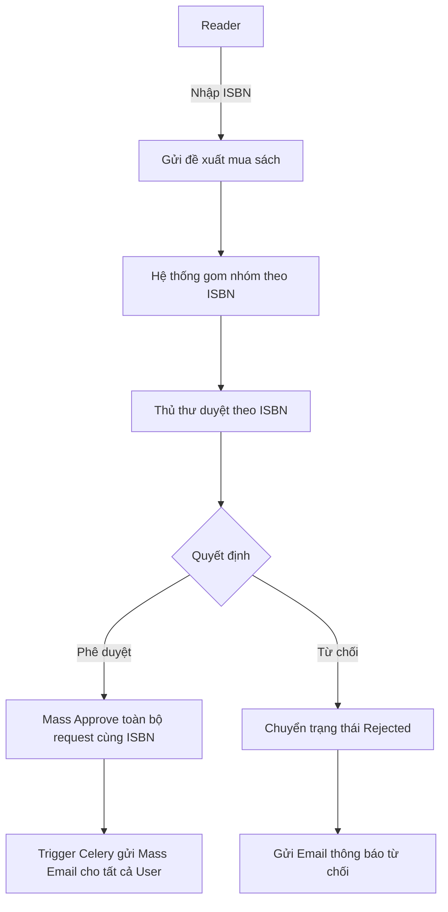
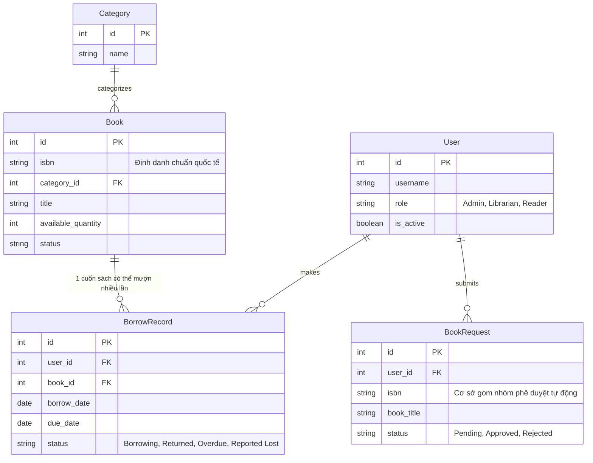

# TÀI LIỆU ĐẶC TẢ YÊU CẦU PHẦN MỀM (SRS)

## Phát triển Hệ thống Quản lý Thư viện trực tuyến

**Công ty DEHA DIGITAL SOLUTIONS – NHÓM 02**

**Phiên bản 4.0**

---

# 1. GIỚI THIỆU TỔNG QUAN

## 1.1 Mục đích tài liệu

Tài liệu đặc tả yêu cầu phần mềm này cung cấp cái nhìn tổng quan, đầy đủ về các yêu cầu và thành phần của dự án Phát triển Hệ thống Quản lý Thư viện trực tuyến (LiMS). Đây là tài liệu tham chiếu chính thức cho toàn bộ các bên tham gia vòng đời phát triển phần mềm.

**Đối tượng sử dụng tài liệu:**

| Đối tượng | Mục đích sử dụng |
|:---|:---|
| Khách hàng | Review, phê duyệt các yêu cầu chức năng và phi chức năng |
| Project Manager | Lập kế hoạch, ước lượng effort, phân chia công việc |
| Đội phát triển (Dev) | Hiểu yêu cầu chi tiết để implement |
| QA/Tester | Viết test case dựa trên luồng chính/thay thế/ngoại lệ |
| Business Analyst | Tham chiếu khi có thay đổi yêu cầu |

## 1.2 Phạm vi hệ thống

| Module | Mô tả | Ghi chú |
|:---|:---|:---|
| Xác thực & Tài khoản | Đăng nhập, đăng xuất, đổi mật khẩu, quản lý hồ sơ cá nhân | Core |
| Quản lý Người dùng | CRUD tài khoản (tách riêng từng thao tác), import hàng loạt, phân quyền RBAC | Admin |
| Quản lý Kho sách | CRUD sách chuẩn ISBN, import hàng loạt, quản lý PDF | Core |
| Quản lý Danh mục | CRUD danh mục sách (Category) | Core |
| Tra cứu & Tương tác | Tìm kiếm sách, xem chi tiết, đánh giá sách | User |
| Đề xuất & Phê duyệt | Đề xuất mua sách theo ISBN, phê duyệt gom nhóm tự động | Operation |
| Lưu thông Sách | Đặt trước, mượn tại quầy, gia hạn, trả, ghi nhận vi phạm Overdue/Lost | Operation |
| Email Notifications | Thông báo tự động SMTP + Celery Cronjob | Nâng cấp |
| Báo cáo & Thống kê | Dashboard chuyên sâu, lịch sử mượn/trả cá nhân | Reporting |

## 1.3 Công nghệ sử dụng

| Lớp | Công nghệ | Phiên bản | Vai trò |
|:---|:---|:---|:---|
| Application Server | Python + Django | 3.10+ / 4.x | Web framework chính (MVT) |
| Frontend | Django Template + Bootstrap 5 + HTMX | – | Render HTML phía server; CẤM dùng SPA |
| Relational DB | MySQL | 8.x | Lưu User, Book, Category, BorrowRecord, Reservation |
| Task Queue | Celery + Redis | Latest stable | Gửi Email async, Cronjob nhắc nhở |
| WSGI Server | Gunicorn | Latest stable | HTTP server production |

## 1.4 Từ điển Thuật ngữ (Glossary)

| Thuật ngữ | Định nghĩa |
|:---|:---|
| BABOK | Business Analysis Body of Knowledge – Chuẩn phân tích nghiệp vụ quốc tế (IIBA) |
| RBAC | Role-Based Access Control – Phân quyền theo vai trò |
| ISBN | International Standard Book Number – Mã số tiêu chuẩn quốc tế định danh duy nhất cho tài liệu sách |
| Main Flow | Luồng chính: Kịch bản lý tưởng, hệ thống hoàn thành mục tiêu use case |
| Alt Flow | Luồng thay thế: Đi qua con đường khác nhưng VẪN đạt mục tiêu |
| Exception Flow | Luồng ngoại lệ: Kịch bản lỗi hoặc vi phạm quy tắc, KHÔNG đạt mục tiêu |
| BorrowRecord | Bản ghi phiếu mượn sách trong CSDL |
| Reservation | Đặt trước sách khi sách đã hết (available\_copies = 0) |
| Celery | Thư viện xử lý tác vụ bất đồng bộ nền (Background Task Queue) |
| HTMX | Thư viện JS siêu nhẹ cho tương tác DOM không reload trang |
| available\_copies | Số cuốn sách hiện đang có sẵn trên kệ |
| total\_copies | Tổng số cuốn sách thư viện sở hữu |
| Category | Danh mục phân loại sách (VD: Công nghệ thông tin, Kinh tế, Văn học...) |

---

# 2. MÔ HÌNH PHÂN QUYỀN (RBAC)

## 2.1 Các vai trò trong hệ thống

| Vai trò | Mô tả | URL prefix | Phạm vi trách nhiệm |
|:---|:---|:---|:---|
| Guest (Khách) | Người dùng chưa đăng nhập | /auth/login/ | Đăng nhập vào hệ thống |
| User – Sinh viên | Sinh viên đang học; đăng nhập bằng Email/Mã SV | /dashboard/ | Mượn/trả, đặt trước, đánh giá, chatbot |
| User – Giảng viên | Giảng viên; quyền mượn cao hơn Sinh viên | /dashboard/ | Tương tự Sinh viên với hạn mức cao hơn |
| Thủ thư | Nhân viên thư viện – nghiệp vụ thư viện | /staff/ | CRUD sách chuẩn ISBN, xử lý mượn/trả, ghi nhận vi phạm, duyệt đề xuất mua |
| Admin | Quản trị viên hệ thống – toàn quyền | /admin/ | CRUD user, cấu hình hệ thống, báo cáo |

## 2.2 Ma trận quyền chức năng

| Chức năng | Guest | Sinh viên | Giảng viên | Thủ thư | Admin |
|:---|:---:|:---:|:---:|:---:|:---:|
| **Nhóm A: Xác thực & Tài khoản** | | | | | |
| UC01 – Đăng nhập | ✓ | ✓ | ✓ | ✓ | ✓ |
| UC02 – Đổi mật khẩu | ✗ | ✓ | ✓ | ✓ | ✓ |
| UC19 – Đăng xuất | ✗ | ✓ | ✓ | ✓ | ✓ |
| UC20 – Xem/Quản lý Hồ sơ cá nhân | ✗ | ✓ | ✓ | ✓ | ✓ |
| **Nhóm B: Quản lý Người dùng** | | | | | |
| UC03a – Thêm mới Người dùng | ✗ | ✗ | ✗ | ✗ | ✓ |
| UC03b – Xem danh sách Người dùng | ✗ | ✗ | ✗ | ✗ | ✓ |
| UC03c – Cập nhật thông tin Người dùng | ✗ | ✗ | ✗ | ✗ | ✓ |
| UC03d – Kích hoạt/Vô hiệu hóa tài khoản | ✗ | ✗ | ✗ | ✗ | ✓ |
| UC03e – Import Người dùng từ Excel | ✗ | ✗ | ✗ | ✗ | ✓ |
| **Nhóm C: Quản lý Kho sách** | | | | | |
| UC04a – Thêm mới Sách | ✗ | ✗ | ✗ | ✓ | ✓ |
| UC04b – Xem danh sách Sách (Quản lý) | ✗ | ✗ | ✗ | ✓ | ✓ |
| UC04c – Cập nhật thông tin Sách | ✗ | ✗ | ✗ | ✓ | ✓ |
| UC04d – Xóa Sách | ✗ | ✗ | ✗ | ✗ | ✓ |
| UC04e – Import Sách từ Excel | ✗ | ✗ | ✗ | ✓ | ✓ |
| UC18 – Quản lý Danh mục Sách | ✗ | ✗ | ✗ | ✓ | ✓ |
| **Nhóm D: Đề xuất & Phê duyệt** | | | | | |
| UC05 – Gửi yêu cầu mua sách mới theo ISBN | ✗ | ✓ | ✓ | ✗ | ✗ |
| UC06 – Phê duyệt gom nhóm yêu cầu mua sách | ✗ | ✗ | ✗ | ✓ | ✗ |
| **Nhóm E: Tra cứu & Tương tác** | | | | | |
| UC07 – Tra cứu & Xem chi tiết Sách | ✗ | ✓ | ✓ | ✓ | ✓ |
| UC12 – Đánh giá Tài liệu | ✗ | ✓ (*) | ✓ (*) | ✗ | ✗ |
| **Nhóm F: Lưu thông Sách** | | | | | |
| UC08 – Đặt trước Sách | ✗ | ✓ (≤2) | ✓ (≤3) | ✗ | ✗ |
| UC09 – Xử lý Mượn Sách tại Quầy | ✗ | ✗ | ✗ | ✓ | ✗ |
| UC10 – Gia hạn Mượn sách | ✗ | ✓ | ✓ | ✗ | ✗ |
| UC11 – Xử lý Trả sách / Ghi nhận Overdue/Lost | ✗ | ✗ | ✗ | ✓ | ✗ |
| UC16 – Quản lý Hàng đợi Đặt trước | ✗ | ✗ | ✗ | ✓ | ✗ |
| **Nhóm H: Báo cáo & Thống kê** | | | | | |
| UC14 – Dashboard Thống kê | ✗ | ✗ | ✗ | ✓ | ✓ |
| UC15 – Xem Lịch sử Mượn/Trả cá nhân | ✗ | ✓ | ✓ | ✗ | ✗ |

*(\*) Chỉ được đánh giá sách đã từng mượn và trả thành công (BR-20).*

---

# 3. TỔNG QUAN QUY TRÌNH NGHIỆP VỤ

## 3.1 Sơ đồ tổng quan các quy trình

Hệ thống LiMS bao gồm 5 quy trình nghiệp vụ chính:



## 3.2 QT1: Quy trình Xác thực & Quản lý Tài khoản

**Mô tả:** Người dùng đăng nhập hệ thống, quản lý thông tin cá nhân, đổi mật khẩu và đăng xuất.

**Luồng quy trình:**
1. Guest truy cập trang chủ → Đăng nhập (UC01)
2. Hệ thống xác thực → Chuyển hướng Dashboard theo vai trò
3. User có thể: Xem/sửa hồ sơ (UC20), Đổi mật khẩu (UC02)
4. User đăng xuất (UC19) → Quay về trang đăng nhập

**UC liên quan:** UC01, UC02, UC19, UC20

**Biểu đồ Luồng công việc (Workflow Diagram):**


## 3.3 QT2: Quy trình Quản lý Người dùng

**Mô tả:** Admin quản lý toàn bộ tài khoản người dùng trong hệ thống.

**Luồng quy trình:**
1. Admin mở Quản lý Người dùng → Xem danh sách (UC03b)
2. Thêm mới đơn lẻ (UC03a) HOẶC Import hàng loạt từ Excel (UC03e)
3. Chỉnh sửa thông tin khi cần (UC03c)
4. Kích hoạt/Vô hiệu hóa tài khoản (UC03d) khi sinh viên tốt nghiệp hoặc vi phạm

**UC liên quan:** UC03a, UC03b, UC03c, UC03d, UC03e

**Biểu đồ Luồng công việc (Workflow Diagram):**


## 3.4 QT3: Quy trình Quản lý Kho sách & Danh mục

**Mô tả:** Thủ thư/Admin quản lý danh mục sách, thêm/sửa/xóa sách.

**Luồng quy trình:**
1. Quản lý Danh mục (UC18): Tạo/sửa/xóa Category
2. Thêm sách mới (UC04a) hoặc Import hàng loạt (UC04e)
3. Cập nhật thông tin sách (UC04c) khi cần
4. Xóa sách (UC04d) khi không còn sử dụng (kiểm tra không có mượn active)

**UC liên quan:** UC04a, UC04b, UC04c, UC04d, UC04e, UC18

**Biểu đồ Luồng công việc (Workflow Diagram):**


## 3.5 QT4: Quy trình Lưu thông Sách

**Mô tả:** Quy trình cốt lõi – từ tra cứu sách đến mượn, gia hạn, trả sách.

**Luồng quy trình:**
1. User tra cứu sách (UC07)
2. **Nếu sách còn:** Đến quầy → Thủ thư xử lý mượn (UC09)
3. **Nếu sách hết:** User đặt trước (UC08) → Chờ email thông báo
4. Khi sách được trả → Hệ thống tự động email cho người đầu hàng đợi
5. User gia hạn online (UC10) nếu cần (max 1 lần, trong 2 ngày trước hạn)
6. User mang sách đến quầy → Thủ thư xử lý trả (UC11)
7. **Nếu quá hạn:** Chuyển trạng thái sang `Overdue` (Ghi nhận lịch sử tín nhiệm)
8. **Nếu hỏng/mất:** Chuyển trạng thái sang `Reported Lost`
9. Thủ thư quản lý hàng đợi đặt trước (UC16)

**UC liên quan:** UC07, UC08, UC09, UC10, UC11, UC16

**Biểu đồ Luồng công việc (Workflow Diagram):**


## 3.6 QT5: Quy trình Đề xuất & Phê duyệt Mua sách

**Mô tả:** User đề xuất mua sách mới, Thủ thư phê duyệt hoặc từ chối.

**Luồng quy trình:**
1. User gửi đề xuất mua sách kèm mã `ISBN` bắt buộc (UC05)
2. Hệ thống gom nhóm các yêu cầu theo mã `ISBN` (Chống rác dữ liệu trùng lặp)
3. Thủ thư xem danh sách đề xuất → Phê duyệt/Từ chối theo mã `ISBN` (UC06)
4. **Nếu Phê duyệt:** Hệ thống tự động chuyển toàn bộ request Pending cùng `ISBN` sang Approved
5. Trigger Celery gửi Email tin vui đồng loạt cho tất cả User đã đề xuất mã `ISBN` đó

**UC liên quan:** UC05, UC06

**Biểu đồ Luồng công việc (Workflow Diagram):**



# 4. ĐẶC TẢ CHI TIẾT CÁC USE CASE

Mỗi Use Case được đặc tả đầy đủ 11 trường chuẩn IIBA v3. Bảng dữ liệu đầu vào được trình bày ngay sau mỗi UC.

---

## NHÓM A: XÁC THỰC & QUẢN LÝ TÀI KHOẢN

---

### UC01 – Đăng nhập vào Hệ thống

| Mã Use Case | UC01 |
|:---|:---|
| **Tên Use Case** | Đăng nhập vào Hệ thống |
| **Tác nhân** | Guest |
| **Mô tả** | Xác thực danh tính người dùng để truy cập các chức năng tương ứng với quyền hạn trong hệ thống LiMS. |
| **Sự kiện kích hoạt** | Người dùng click vào nút "Đăng nhập" trên trang chủ. |
| **Tiền điều kiện** | Tài khoản đã được Admin cấp phát và đang ở trạng thái is\_active = True. |
| **Luồng chính (Main Flow)** | 1. Hệ thống hiển thị Form đăng nhập.<br>2. Tác nhân nhập Tên đăng nhập và Mật khẩu.<br>3. Tác nhân bấm nút "Đăng nhập".<br>4. Hệ thống validate dữ liệu đầu vào (không rỗng, đúng format).<br>5. Hệ thống xác thực thông tin đăng nhập trong DB (hash mật khẩu).<br>6. Xác thực thành công → Hệ thống khởi tạo Django Session.<br>7. Chuyển hướng đến Dashboard tương ứng vai trò (Admin → /admin/, Thủ thư → /staff/, User → /dashboard/). |
| **Luồng thay thế (Alt Flow)** | Không có luồng thay thế. |
| **Luồng ngoại lệ (Exception Flow)** | **(E1)** Sai thông tin đăng nhập → Hiển thị thông báo lỗi chung "Tên đăng nhập hoặc mật khẩu không chính xác" (BR-01).<br>**(E2)** Tài khoản bị khóa: is\_active = False → Thông báo "Tài khoản đã bị vô hiệu hóa, vui lòng liên hệ thủ thư".<br>**(E3)** Khóa IP sau 5 lần sai liên tiếp (BR-02) → Chặn 15 phút, hiển thị đồng hồ đếm ngược. |
| **Hậu điều kiện** | Session đăng nhập hợp lệ được khởi tạo. Người dùng được chuyển hướng đến Dashboard phù hợp vai trò. |
| **Business Rules** | - BR-01: Thông báo lỗi không tiết lộ trường nào bị sai.<br> - BR-02: Tạm khóa IP 15 phút sau 5 lần đăng nhập sai liên tiếp. |

**Bảng Dữ liệu Đầu vào – UC01**

| # | Tên trường | Kiểu | Bắt buộc | Validation Rules | Ví dụ / Ghi chú |
|:---:|:---|:---|:---:|:---|:---|
| 1 | Tên đăng nhập | Text | Có | Max 255 chars; định dạng Email hoặc Mã SV/GV hợp lệ | sv2020@edu.vn |
| 2 | Mật khẩu | Password | Có | Min 8 ký tự; hiển thị dạng ẩn (•••••••) | •••••••• |

---

### UC02 – Đổi mật khẩu

| Mã Use Case | UC02 |
|:---|:---|
| **Tên Use Case** | Đổi mật khẩu |
| **Tác nhân** | User (Sinh viên / Giảng viên), Thủ thư, Admin |
| **Mô tả** | Người dùng tự thay đổi mật khẩu cá nhân để bảo vệ tài khoản. |
| **Sự kiện kích hoạt** | Người dùng click "Đổi mật khẩu" trong trang Hồ sơ cá nhân. |
| **Tiền điều kiện** | Người dùng đang có phiên đăng nhập hợp lệ. |
| **Luồng chính (Main Flow)** | 1. Hệ thống hiển thị Form Đổi mật khẩu.<br>2. Người dùng nhập đầy đủ: Mật khẩu hiện tại, Mật khẩu mới, Xác nhận mật khẩu mới.<br>3. Người dùng bấm "Lưu thay đổi".<br>4. Hệ thống xác thực Mật khẩu hiện tại khớp với hash trong DB.<br>5. Hệ thống validate Mật khẩu mới theo BR-03 và BR-04.<br>6. Hash mật khẩu mới bằng Argon2 và lưu vào DB.<br>7. Hủy Session hiện tại → Báo thành công → Chuyển hướng về trang Đăng nhập. |
| **Luồng thay thế (Alt Flow)** | Không có luồng thay thế. |
| **Luồng ngoại lệ (Exception Flow)** | **(E1)** Sai mật khẩu hiện tại → Báo lỗi "Mật khẩu hiện tại không chính xác".<br>**(E2)** Mật khẩu mới không khớp xác nhận → Báo lỗi "Mật khẩu xác nhận không khớp".<br>**(E3)** Mật khẩu mới quá yếu (vi phạm BR-03) → Báo lỗi chi tiết yêu cầu đáp ứng.<br>**(E4)** Mật khẩu mới trùng mật khẩu cũ (vi phạm BR-04) → Báo lỗi "Mật khẩu mới không được trùng mật khẩu hiện tại". |
| **Hậu điều kiện** | Mật khẩu mới được lưu an toàn (Argon2). Session hiện tại bị hủy, người dùng phải đăng nhập lại. |
| **Business Rules** | - BR-03: Mật khẩu mới tối thiểu 8 ký tự, có ít nhất 1 chữ hoa, 1 chữ thường, 1 chữ số.<br> - BR-04: Mật khẩu mới không được trùng với mật khẩu hiện tại. |

**Bảng Dữ liệu Đầu vào – UC02**

| # | Tên trường | Kiểu | Bắt buộc | Validation Rules | Ví dụ / Ghi chú |
|:---:|:---|:---|:---:|:---|:---|
| 1 | Mật khẩu hiện tại | Password | Có | Phải khớp với giá trị hash đang lưu trong DB | •••••••• |
| 2 | Mật khẩu mới | Password | Có | Thỏa mãn BR-03; khác hoàn toàn với mật khẩu hiện tại (BR-04) | •••••••• |
| 3 | Xác nhận mật khẩu | Password | Có | Phải khớp hoàn toàn với trường Mật khẩu mới | •••••••• |

---

### UC19 – Đăng xuất khỏi Hệ thống

| Mã Use Case | UC19 |
|:---|:---|
| **Tên Use Case** | Đăng xuất khỏi Hệ thống |
| **Tác nhân** | User (Sinh viên / Giảng viên), Thủ thư, Admin |
| **Mô tả** | Người dùng kết thúc phiên làm việc, hủy session đăng nhập và quay về trang chủ. |
| **Sự kiện kích hoạt** | Người dùng click nút "Đăng xuất" trên thanh navigation bar. |
| **Tiền điều kiện** | Người dùng đang có phiên đăng nhập hợp lệ. |
| **Luồng chính (Main Flow)** | 1. Người dùng bấm nút "Đăng xuất".<br>2. Hệ thống hủy Django Session hiện tại (flush session).<br>3. Xóa toàn bộ cookie liên quan đến phiên đăng nhập.<br>4. Chuyển hướng người dùng về trang chủ (trang đăng nhập).<br>5. Hiển thị thông báo "Bạn đã đăng xuất thành công". |
| **Luồng thay thế (Alt Flow)** | **(A1)** Session tự động hết hạn (BR-25): Khi session timeout sau 8h không hoạt động → Hệ thống tự động hủy session → Chuyển hướng về trang đăng nhập khi User thao tác tiếp. |
| **Luồng ngoại lệ (Exception Flow)** | **(E1)** Session đã hết hạn trước khi bấm Đăng xuất → Chuyển thẳng về trang Đăng nhập. |
| **Hậu điều kiện** | Session bị hủy. Cookie đăng nhập bị xóa. Người dùng không thể truy cập các trang yêu cầu đăng nhập. |
| **Business Rules** | - BR-25: Session tự động hết hạn sau 8 giờ không hoạt động. |

---

### UC20 – Xem / Quản lý Hồ sơ cá nhân

| Mã Use Case | UC20 |
|:---|:---|
| **Tên Use Case** | Xem / Quản lý Hồ sơ cá nhân |
| **Tác nhân** | User (Sinh viên / Giảng viên), Thủ thư, Admin |
| **Mô tả** | Người dùng xem thông tin hồ sơ cá nhân và cập nhật một số trường được phép (tên hiển thị, avatar, số điện thoại). |
| **Sự kiện kích hoạt** | Người dùng click vào avatar/tên trên thanh navigation → chọn "Hồ sơ cá nhân". |
| **Tiền điều kiện** | Người dùng đang có phiên đăng nhập hợp lệ. |
| **Luồng chính (Main Flow)** | 1. Hệ thống hiển thị trang Hồ sơ cá nhân với thông tin: Mã SV/GV (readonly), Email (readonly), Họ và tên, Vai trò (readonly), Số điện thoại, Avatar.<br>2. Người dùng chỉnh sửa các trường được phép.<br>3. Người dùng bấm "Lưu thay đổi".<br>4. Hệ thống validate dữ liệu đầu vào.<br>5. Cập nhật thông tin vào DB.<br>6. Hiển thị thông báo "Cập nhật hồ sơ thành công". |
| **Luồng thay thế (Alt Flow)** | **(A1)** Người dùng chỉ xem hồ sơ mà không chỉnh sửa → Không có thay đổi DB. |
| **Luồng ngoại lệ (Exception Flow)** | **(E1)** Số điện thoại sai format → Báo lỗi "Số điện thoại không hợp lệ".<br>**(E2)** Avatar vượt kích thước cho phép (BR-26) → Báo lỗi. |
| **Hậu điều kiện** | Thông tin cá nhân được cập nhật trong DB. |
| **Business Rules** | - BR-26: Avatar tối đa 2MB; định dạng JPG/PNG. Mã SV/GV, Email, Vai trò không được phép tự sửa. |

**Bảng Dữ liệu Đầu vào – UC20**

| # | Tên trường | Kiểu | Bắt buộc | Validation Rules | Ví dụ / Ghi chú |
|:---:|:---|:---|:---:|:---|:---|
| 1 | Họ và tên | Text | Có | Max 255 chars; không chứa số | Nguyễn Văn A |
| 2 | Số điện thoại | Text | Không | Format: 10 chữ số, bắt đầu bằng 0 | 0901234567 |
| 3 | Avatar | File Upload | Không | JPG/PNG; tối đa 2MB (BR-26) | avatar.jpg |

---

## NHÓM B: QUẢN LÝ NGƯỜI DÙNG

---

### UC03a – Thêm mới Người dùng

| Mã Use Case | UC03a |
|:---|:---|
| **Tên Use Case** | Thêm mới Người dùng |
| **Tác nhân** | Admin |
| **Mô tả** | Admin tạo mới một tài khoản người dùng trong hệ thống, hệ thống sinh mật khẩu tạm thời và gửi email chào mừng. |
| **Sự kiện kích hoạt** | Admin click nút "Thêm mới" trong màn hình Quản lý Người dùng. |
| **Tiền điều kiện** | Admin đã đăng nhập và có quyền Quản lý Người dùng. |
| **Luồng chính (Main Flow)** | 1. Admin bấm "Thêm mới" → Hệ thống hiển thị Form tạo người dùng.<br>2. Admin nhập: Mã SV/GV, Email, Họ và tên, Vai trò (Sinh viên / Giảng viên).<br>3. Admin bấm "Lưu".<br>4. Hệ thống validate: Mã SV/GV unique, Email unique, format hợp lệ.<br>5. Hệ thống sinh mật khẩu ngẫu nhiên an toàn (16 ký tự).<br>6. Hệ thống hash mật khẩu bằng Argon2 và tạo bản ghi CustomUser trong DB (is\_active = True).<br>7. Hệ thống gửi Email chào mừng kèm mật khẩu tạm thời (qua Celery async).<br>8. Hiển thị thông báo "Tạo tài khoản thành công cho [Họ và tên]". |
| **Luồng thay thế (Alt Flow)** | Không có luồng thay thế. |
| **Luồng ngoại lệ (Exception Flow)** | **(E1)** Trùng Mã SV/GV → Báo lỗi "Mã SV/GV đã tồn tại trong hệ thống".<br>**(E2)** Trùng Email → Báo lỗi "Email đã được sử dụng bởi tài khoản khác".<br>**(E3)** Họ và tên chứa số hoặc ký tự đặc biệt → Báo lỗi validation.<br>**(E4)** Email không đúng format RFC 5322 → Báo lỗi validation. |
| **Hậu điều kiện** | Tài khoản mới được tạo trong DB với is\_active = True. Email chào mừng được đưa vào hàng đợi Celery. |
| **Business Rules** | - Không có BR riêng (sử dụng validation chuẩn). |

**Bảng Dữ liệu Đầu vào – UC03a**

| # | Tên trường | Kiểu | Bắt buộc | Validation Rules | Ví dụ / Ghi chú |
|:---:|:---|:---|:---:|:---|:---|
| 1 | Mã SV/GV | Text | Có | Unique; không ký tự đặc biệt; Max 20 chars | SV2022001 |
| 2 | Email | Email | Có | Unique; định dạng RFC 5322 chuẩn | sv@edu.vn |
| 3 | Họ và tên | Text | Có | Max 255 chars; không để trống; không chứa số | Nguyễn Văn A |
| 4 | Vai trò | Dropdown | Có | Chỉ nhận: 'Sinh viên' hoặc 'Giảng viên' | Sinh viên |

---

### UC03b – Xem danh sách & Chi tiết Người dùng

| Mã Use Case | UC03b |
|:---|:---|
| **Tên Use Case** | Xem danh sách & Chi tiết Người dùng |
| **Tác nhân** | Admin |
| **Mô tả** | Admin xem danh sách toàn bộ người dùng, tìm kiếm/lọc theo điều kiện, và xem chi tiết từng tài khoản. |
| **Sự kiện kích hoạt** | Admin truy cập trang Quản lý Người dùng. |
| **Tiền điều kiện** | Admin đã đăng nhập. |
| **Luồng chính (Main Flow)** | 1. Hệ thống hiển thị danh sách người dùng dạng bảng, phân trang (10 records/trang – NFR-02).<br>2. Mỗi dòng hiển thị: Mã SV/GV, Họ tên, Email, Vai trò, Trạng thái (Active/Inactive), Số sách đang mượn.<br>3. Admin có thể tìm kiếm theo từ khóa (tên, mã, email).<br>4. Admin có thể lọc theo: Vai trò, Trạng thái.<br>5. Click vào 1 người dùng → Xem chi tiết: Thông tin cá nhân, Lịch sử mượn/trả, Danh sách vi phạm quá hạn/báo mất, Đề xuất mua sách theo ISBN. |
| **Luồng thay thế (Alt Flow)** | **(A1)** Export danh sách người dùng ra Excel: Admin bấm "Xuất Excel" → Hệ thống tạo file .xlsx chứa danh sách hiện tại. |
| **Luồng ngoại lệ (Exception Flow)** | **(E1)** Không có kết quả tìm kiếm → Hiển thị "Không tìm thấy người dùng phù hợp". |
| **Hậu điều kiện** | Không có thay đổi dữ liệu. Admin có thông tin cần thiết để quản lý. |
| **Business Rules** | - BR-11: Tìm kiếm không phân biệt hoa/thường, tự trim whitespace. |

---

### UC03c – Cập nhật thông tin Người dùng

| Mã Use Case | UC03c |
|:---|:---|
| **Tên Use Case** | Cập nhật thông tin Người dùng |
| **Tác nhân** | Admin |
| **Mô tả** | Admin chỉnh sửa thông tin cá nhân của một người dùng đã tồn tại trong hệ thống. |
| **Sự kiện kích hoạt** | Admin click nút "Chỉnh sửa" trên dòng người dùng cần sửa hoặc trong trang chi tiết. |
| **Tiền điều kiện** | Admin đã đăng nhập. Người dùng cần sửa tồn tại trong DB. |
| **Luồng chính (Main Flow)** | 1. Hệ thống hiển thị Form chỉnh sửa với dữ liệu hiện tại: Mã SV/GV (readonly), Email, Họ và tên, Vai trò.<br>2. Admin chỉnh sửa các trường cần thay đổi.<br>3. Admin bấm "Lưu thay đổi".<br>4. Hệ thống validate dữ liệu: Email unique (trừ chính user này), format hợp lệ.<br>5. Cập nhật DB.<br>6. Hiển thị thông báo "Cập nhật thông tin thành công". |
| **Luồng thay thế (Alt Flow)** | **(A1)** Reset mật khẩu: Admin bấm "Reset mật khẩu" → Hệ thống sinh mật khẩu mới → Gửi email cho user. |
| **Luồng ngoại lệ (Exception Flow)** | **(E1)** Email mới trùng với user khác → Báo lỗi "Email đã được sử dụng".<br>**(E2)** Dữ liệu không hợp lệ → Báo lỗi validation chi tiết. |
| **Hậu điều kiện** | Thông tin người dùng được cập nhật trong DB. |
| **Business Rules** | - Mã SV/GV không được phép thay đổi sau khi tạo. |

**Bảng Dữ liệu Đầu vào – UC03c**

| # | Tên trường | Kiểu | Bắt buộc | Validation Rules | Ví dụ / Ghi chú |
|:---:|:---|:---|:---:|:---|:---|
| 1 | Email | Email | Có | Unique (trừ chính user đang sửa); RFC 5322 | sv_new@edu.vn |
| 2 | Họ và tên | Text | Có | Max 255 chars; không chứa số | Nguyễn Văn B |
| 3 | Vai trò | Dropdown | Có | 'Sinh viên' hoặc 'Giảng viên' | Giảng viên |

---

### UC03d – Kích hoạt / Vô hiệu hóa Tài khoản

| Mã Use Case | UC03d |
|:---|:---|
| **Tên Use Case** | Kích hoạt / Vô hiệu hóa Tài khoản |
| **Tác nhân** | Admin |
| **Mô tả** | Admin thay đổi trạng thái hoạt động của tài khoản người dùng (is\_active toggle). Tài khoản bị vô hiệu hóa không thể đăng nhập. |
| **Sự kiện kích hoạt** | Admin click nút "Vô hiệu hóa" hoặc "Kích hoạt" trên trang chi tiết người dùng. |
| **Tiền điều kiện** | Admin đã đăng nhập. Tài khoản mục tiêu tồn tại trong DB. |
| **Luồng chính (Main Flow) – Vô hiệu hóa** | 1. Admin bấm "Vô hiệu hóa" trên tài khoản mục tiêu.<br>2. Hệ thống kiểm tra tài khoản không có BorrowRecord chưa hoàn thành (Borrowed, Overdue, Reported Lost) (BR-05).<br>3. Hệ thống kiểm tra Admin không tự vô hiệu hóa chính mình (BR-27).<br>4. Hiển thị dialog xác nhận: "Bạn có chắc muốn vô hiệu hóa tài khoản [Họ tên]?".<br>5. Admin xác nhận → Hệ thống set is\_active = False.<br>6. Hủy tất cả Session đang active của user đó.<br>7. Hiển thị thông báo "Tài khoản đã bị vô hiệu hóa". |
| **Luồng thay thế (Alt Flow)** | **(A1)** Kích hoạt lại tài khoản: Admin bấm "Kích hoạt" → set is\_active = True → Hiển thị thông báo. |
| **Luồng ngoại lệ (Exception Flow)** | **(E1)** User đang nợ sách hoặc vi phạm tín nhiệm (vi phạm BR-05) → Báo lỗi "Không thể vô hiệu hóa: tài khoản đang có BorrowRecord chưa hoàn thành".<br>**(E2)** Admin tự vô hiệu hóa mình (vi phạm BR-27) → Báo lỗi "Không thể vô hiệu hóa tài khoản của chính bạn". |
| **Hậu điều kiện** | Trạng thái is\_active được thay đổi. Nếu vô hiệu hóa: session bị hủy, user không thể đăng nhập. |
| **Business Rules** | - BR-05: Không vô hiệu hóa tài khoản đang có BorrowRecord chưa hoàn thành (Borrowed, Overdue, Reported Lost).<br> - BR-27: Admin không được tự vô hiệu hóa chính mình. |

---

### UC03e – Import Người dùng hàng loạt từ Excel

| Mã Use Case | UC03e |
|:---|:---|
| **Tên Use Case** | Import Người dùng hàng loạt từ Excel |
| **Tác nhân** | Admin |
| **Mô tả** | Admin upload file Excel (.xlsx) chứa danh sách người dùng, hệ thống validate từng dòng và tạo tài khoản hàng loạt. |
| **Sự kiện kích hoạt** | Admin click nút "Import Excel" trong màn hình Quản lý Người dùng. |
| **Tiền điều kiện** | Admin đã đăng nhập. File Excel đúng template quy định. |
| **Luồng chính (Main Flow)** | 1. Admin bấm "Import Excel" → Hệ thống hiển thị dialog upload.<br>2. Admin chọn file .xlsx và bấm "Upload".<br>3. Hệ thống validate file: đúng định dạng .xlsx, không quá 500 dòng (BR-06).<br>4. Hệ thống hiển thị preview: Tổng số dòng, Số dòng hợp lệ, Số dòng lỗi (nếu có).<br>5. Admin review preview → Bấm "Xác nhận Import".<br>6. Hệ thống xử lý từng dòng hợp lệ: tạo tài khoản, sinh mật khẩu, hash Argon2.<br>7. Gửi email chào mừng cho từng tài khoản mới (Celery batch).<br>8. Hiển thị báo cáo kết quả: X tài khoản tạo thành công, Y dòng bị lỗi (kèm chi tiết lỗi từng dòng). |
| **Luồng thay thế (Alt Flow)** | **(A1)** Tải template Excel: Admin bấm "Tải template" → Hệ thống trả file mẫu .xlsx. |
| **Luồng ngoại lệ (Exception Flow)** | **(E1)** File không phải .xlsx → Báo lỗi "Chỉ hỗ trợ file Excel định dạng .xlsx".<br>**(E2)** File quá 500 dòng (vi phạm BR-06) → Báo lỗi "File chứa quá 500 dòng. Vui lòng chia nhỏ file".<br>**(E3)** Dòng bị lỗi (trùng mã, sai format) → Skip dòng lỗi, ghi nhận chi tiết lỗi, tiếp tục xử lý dòng tiếp theo.<br>**(E4)** Toàn bộ dòng lỗi → Báo lỗi "Không có dòng nào hợp lệ" kèm chi tiết. |
| **Hậu điều kiện** | Các tài khoản hợp lệ được tạo trong DB. Báo cáo kết quả import được hiển thị. Email chào mừng được gửi. |
| **Business Rules** | - BR-06: File Import tối đa 500 dòng/lần; định dạng .xlsx duy nhất. |

**Bảng Dữ liệu Đầu vào – UC03e**

| # | Tên trường | Kiểu | Bắt buộc | Validation Rules | Ví dụ / Ghi chú |
|:---:|:---|:---|:---:|:---|:---|
| 1 | File Excel | File Upload | Có | .xlsx; tối đa 500 dòng (BR-06) | users_import.xlsx |

**Cấu trúc file Excel (template):**

| Cột | Tên cột | Kiểu | Bắt buộc | Validation |
|:---:|:---|:---|:---:|:---|
| A | Mã SV/GV | Text | Có | Unique; Max 20 chars |
| B | Email | Email | Có | Unique; RFC 5322 |
| C | Họ và tên | Text | Có | Max 255 chars |
| D | Vai trò | Text | Có | 'Sinh viên' hoặc 'Giảng viên' |

---

## NHÓM C: QUẢN LÝ KHO SÁCH & DANH MỤC

---

### UC04a – Thêm mới Sách vào Kho

| Mã Use Case | UC04a |
|:---|:---|
| **Tên Use Case** | Thêm mới Sách vào Kho |
| **Tác nhân** | Admin, Thủ thư |
| **Mô tả** | Tác nhân thêm một cuốn sách mới vào hệ thống thư viện với đầy đủ metadata. |
| **Sự kiện kích hoạt** | Tác nhân click "Thêm sách mới" trong giao diện Quản lý Kho sách. |
| **Tiền điều kiện** | Tác nhân đã đăng nhập với quyền Quản lý kho sách. Danh mục sách (Category) đã được tạo sẵn. |
| **Luồng chính (Main Flow)** | 1. Hệ thống hiển thị Form thêm sách mới.<br>2. Tác nhân nhập: Tiêu đề, Tác giả, ISBN, Số lượng, Giá bìa, Danh mục, Năm xuất bản, Nhà xuất bản.<br>3. Tác nhân bấm "Lưu".<br>4. Hệ thống validate: ISBN unique (chuẩn ISBN-10 hoặc ISBN-13), Số lượng ≥ 1, Giá >0.<br>5. Hệ thống tạo bản ghi Book trong MySQL: set available\_copies = total\_copies (BR-08).<br>6. Hiển thị thông báo "Thêm sách thành công" + link xem chi tiết. |
| **Luồng thay thế (Alt Flow)** | Không có luồng thay thế. |
| **Luồng ngoại lệ (Exception Flow)** | **(E1)** Trùng ISBN → Báo lỗi "ISBN đã tồn tại trong hệ thống" + link đến sách có ISBN trùng.<br>**(E2)** Số lượng < 1 → Báo lỗi "Số lượng phải lớn hơn hoặc bằng 1".<br>**(E3)** Giá ≤ 0 → Báo lỗi "Giá bìa phải lớn hơn 0".<br>**(E4)** Danh mục không hợp lệ → Báo lỗi. |
| **Hậu điều kiện** | Sách mới được tạo trong CSDL. available\_copies = total\_copies (BR-08). |
| **Business Rules** | - BR-08: available\_copies ban đầu phải bằng total\_copies khi tạo mới sách. |

**Bảng Dữ liệu Đầu vào – UC04a**

| # | Tên trường | Kiểu | Bắt buộc | Validation Rules | Ví dụ / Ghi chú |
|:---:|:---|:---|:---:|:---|:---|
| 1 | Tiêu đề sách | Text | Có | Max 255 chars | Lập trình Python căn bản |
| 2 | Tác giả | Text | Có | Max 255 chars | Nguyễn Văn Bình |
| 3 | ISBN | Text | Có | Unique; chuẩn ISBN-10 hoặc ISBN-13 | 978-604-0-12345-6 |
| 4 | Danh mục | Dropdown | Có | Chỉ nhận giá trị từ bảng Category | Công nghệ thông tin |
| 5 | Số lượng | Number | Có | Số nguyên ≥ 1; auto set available\_copies = giá trị này | 5 |
| 6 | Giá bìa (VND) | Currency | Có | Số thực > 0; dùng định giá bồi thường tài liệu vật lý (BR-18) | 150000 |
| 7 | Năm xuất bản | Number | Không | Số nguyên; ≤ năm hiện tại | 2024 |
| 8 | Nhà xuất bản | Text | Không | Max 255 chars | NXB Giáo dục |

---

### UC04b – Xem danh sách & Chi tiết Sách (Quản lý)

| Mã Use Case | UC04b |
|:---|:---|
| **Tên Use Case** | Xem danh sách & Chi tiết Sách (Góc nhìn Quản lý) |
| **Tác nhân** | Admin, Thủ thư |
| **Mô tả** | Tác nhân xem danh sách toàn bộ sách trong kho, tìm kiếm/lọc, và xem chi tiết bao gồm thông tin quản lý (trạng thái embed PDF, thống kê mượn). |
| **Sự kiện kích hoạt** | Tác nhân truy cập trang Quản lý Kho sách. |
| **Tiền điều kiện** | Tác nhân đã đăng nhập với quyền Quản lý kho sách. |
| **Luồng chính (Main Flow)** | 1. Hệ thống hiển thị danh sách sách dạng bảng, phân trang (10 records/trang).<br>2. Mỗi dòng hiển thị: Tiêu đề, Tác giả, ISBN, Danh mục, Tổng/Còn, Trạng thái PDF, Rating.<br>3. Tác nhân có thể tìm kiếm theo từ khóa (tiêu đề, tác giả, ISBN).<br>4. Tác nhân có thể lọc: Danh mục, Trạng thái (còn/hết), Có PDF/Không.<br>5. Tác nhân click vào 1 cuốn sách → Xem chi tiết quản lý: Metadata, Trạng thái embed PDF, Danh sách người đang mượn, Lịch sử mượn/trả, Hàng đợi đặt trước, Reviews. |
| **Luồng thay thế (Alt Flow)** | **(A1)** Export danh sách sách ra Excel. |
| **Luồng ngoại lệ (Exception Flow)** | **(E1)** Không có kết quả → Hiển thị "Không tìm thấy sách phù hợp". |
| **Hậu điều kiện** | Không thay đổi dữ liệu. |
| **Business Rules** | - BR-11: Tìm kiếm fulltext không phân biệt hoa/thường. |

---

### UC04c – Cập nhật thông tin Sách

| Mã Use Case | UC04c |
|:---|:---|
| **Tên Use Case** | Cập nhật thông tin Sách |
| **Tác nhân** | Admin, Thủ thư |
| **Mô tả** | Tác nhân chỉnh sửa metadata của sách đã tồn tại (tiêu đề, tác giả, số lượng, giá, danh mục). |
| **Sự kiện kích hoạt** | Tác nhân click "Chỉnh sửa" trên dòng sách hoặc trong trang chi tiết sách. |
| **Tiền điều kiện** | Tác nhân đã đăng nhập. Sách tồn tại trong DB. |
| **Luồng chính (Main Flow)** | 1. Hệ thống hiển thị Form chỉnh sửa với dữ liệu hiện tại.<br>2. Tác nhân chỉnh sửa các trường: Tiêu đề, Tác giả, Danh mục, Giá bìa, Số lượng tổng (total\_copies).<br>3. Tác nhân bấm "Lưu thay đổi".<br>4. Hệ thống validate dữ liệu.<br>5. Nếu total\_copies thay đổi → Hệ thống tính lại available\_copies: available\_copies = available\_copies + (new\_total - old\_total) (BR-28).<br>6. Cập nhật DB.<br>7. Hiển thị thông báo "Cập nhật sách thành công". |
| **Luồng thay thế (Alt Flow)** | Không có luồng thay thế. |
| **Luồng ngoại lệ (Exception Flow)** | **(E1)** available\_copies mới < 0 sau khi giảm total\_copies (vi phạm BR-28) → Báo lỗi "Không thể giảm tổng số lượng: hiện có X cuốn đang được mượn".<br>**(E2)** ISBN trùng với sách khác → Báo lỗi. |
| **Hậu điều kiện** | Thông tin sách được cập nhật. available\_copies được tính lại nếu total\_copies thay đổi. |
| **Business Rules** | - BR-28: Khi thay đổi total\_copies, available\_copies mới không được âm (phải ≥ 0). Công thức: new\_available = old\_available + (new\_total - old\_total). |

**Bảng Dữ liệu Đầu vào – UC04c**

| # | Tên trường | Kiểu | Bắt buộc | Validation Rules | Ví dụ / Ghi chú |
|:---:|:---|:---|:---:|:---|:---|
| 1 | Tiêu đề sách | Text | Có | Max 255 chars | Lập trình Python nâng cao |
| 2 | Tác giả | Text | Có | Max 255 chars | Nguyễn Văn Bình |
| 3 | Danh mục | Dropdown | Có | Giá trị từ bảng Category | Công nghệ thông tin |
| 4 | Số lượng tổng | Number | Có | Số nguyên ≥ 1; kiểm tra BR-28 | 10 |
| 5 | Giá bìa (VND) | Currency | Có | Số thực > 0 | 200000 |

---

### UC04d – Xóa Sách khỏi Hệ thống

| Mã Use Case | UC04d |
|:---|:---|
| **Tên Use Case** | Xóa Sách khỏi Hệ thống |
| **Tác nhân** | Admin |
| **Mô tả** | Admin xóa vĩnh viễn sách khỏi hệ thống khi sách không còn sử dụng, kèm xóa dữ liệu liên quan (vectors ChromaDB). |
| **Sự kiện kích hoạt** | Admin click nút "Xóa" trên trang chi tiết sách. |
| **Tiền điều kiện** | Admin đã đăng nhập. Sách tồn tại trong DB. |
| **Luồng chính (Main Flow)** | 1. Admin bấm "Xóa sách".<br>2. Hệ thống kiểm tra: không có BorrowRecord active (status = borrowed/overdue) cho sách này.<br>3. Hệ thống kiểm tra: không có Reservation đang Waiting/Notified.<br>4. Hiển thị dialog xác nhận: "Bạn có chắc muốn xóa sách [Tiêu đề]? Hành động này không thể hoàn tác."<br>5. Admin xác nhận.<br>6. Hệ thống xóa vectors trong ChromaDB (nếu có PDFDocument).<br>7. Hệ thống xóa PDFDocument record và file PDF vật lý.<br>8. Hệ thống xóa Book record (cascade: Reviews, BorrowRecords đã hoàn thành).<br>9. Hiển thị thông báo "Xóa sách thành công". |
| **Luồng thay thế (Alt Flow)** | Không có luồng thay thế. |
| **Luồng ngoại lệ (Exception Flow)** | **(E1)** Sách đang có người mượn (BorrowRecord active) → Báo lỗi "Không thể xóa: sách đang được mượn bởi X người".<br>**(E2)** Sách đang có người đặt trước → Báo lỗi "Không thể xóa: sách đang có Y người đặt trước".<br>**(E3)** Admin hủy xác nhận → Quay lại trang chi tiết. |
| **Hậu điều kiện** | Sách bị xóa vĩnh viễn. Reviews và BorrowRecords đã hoàn thành bị cascade delete. |
| **Business Rules** | - Không xóa sách có BorrowRecord active hoặc Reservation đang chờ. |

---

### UC04e – Import Sách hàng loạt từ Excel

| Mã Use Case | UC04e |
|:---|:---|
| **Tên Use Case** | Import Sách hàng loạt từ Excel |
| **Tác nhân** | Admin, Thủ thư |
| **Mô tả** | Tác nhân upload file Excel (.xlsx) chứa danh sách sách (chỉ metadata, không có PDF), hệ thống validate và tạo hàng loạt. |
| **Sự kiện kích hoạt** | Tác nhân click nút "Import Excel" trong Quản lý Kho sách. |
| **Tiền điều kiện** | Tác nhân đã đăng nhập. File Excel đúng template. |
| **Luồng chính (Main Flow)** | 1. Tác nhân bấm "Import Excel" → Upload file .xlsx.<br>2. Hệ thống validate file: .xlsx, ≤ 500 dòng (BR-06).<br>3. Hệ thống preview: Tổng dòng, Hợp lệ, Lỗi.<br>4. Tác nhân xác nhận.<br>5. Hệ thống tạo Book records cho các dòng hợp lệ (available\_copies = total\_copies).<br>6. Hiển thị báo cáo kết quả. |
| **Luồng thay thế (Alt Flow)** | **(A1)** Tải template Excel mẫu. |
| **Luồng ngoại lệ (Exception Flow)** | **(E1)** File sai định dạng → Báo lỗi.<br>**(E2)** Quá 500 dòng → Báo lỗi.<br>**(E3)** Dòng bị trùng ISBN → Skip, ghi nhận lỗi. |
| **Hậu điều kiện** | Sách hợp lệ được tạo trong DB. Báo cáo import hiển thị. |
| **Business Rules** | - BR-06,<br> - BR-08. |

---


### UC18 – Quản lý Danh mục Sách (Category)

| Mã Use Case | UC18 |
|:---|:---|
| **Tên Use Case** | Quản lý Danh mục Sách (Category) |
| **Tác nhân** | Admin, Thủ thư |
| **Mô tả** | Tác nhân quản lý danh mục phân loại sách: thêm mới, chỉnh sửa, xóa danh mục. |
| **Sự kiện kích hoạt** | Tác nhân truy cập trang Quản lý Danh mục hoặc bấm "Quản lý Danh mục" trong Kho sách. |
| **Tiền điều kiện** | Tác nhân đã đăng nhập với quyền Quản lý kho sách. |
| **Luồng chính (Main Flow) – Thêm mới** | 1. Tác nhân bấm "Thêm danh mục mới".<br>2. Nhập: Tên danh mục, Mô tả.<br>3. Bấm "Lưu".<br>4. Hệ thống validate: Tên unique, không rỗng.<br>5. Tạo Category trong DB.<br>6. Hiển thị thông báo thành công. |
| **Luồng thay thế (Alt Flow)** | **(A1)** Chỉnh sửa danh mục: Tác nhân click "Sửa" → Form hiện dữ liệu cũ → Sửa → Lưu.<br>**(A2)** Xóa danh mục: Tác nhân click "Xóa" → Hệ thống kiểm tra không còn sách thuộc danh mục (BR-29) → Xác nhận → Xóa. |
| **Luồng ngoại lệ (Exception Flow)** | **(E1)** Tên danh mục trùng → Báo lỗi "Danh mục đã tồn tại".<br>**(E2)** Xóa danh mục còn sách (vi phạm BR-29) → Báo lỗi "Không thể xóa: danh mục đang chứa X cuốn sách". |
| **Hậu điều kiện** | Danh mục được tạo/cập nhật/xóa trong DB. |
| **Business Rules** | - BR-29: Category không thể xóa nếu còn sách thuộc danh mục đó. |

**Bảng Dữ liệu Đầu vào – UC18**

| # | Tên trường | Kiểu | Bắt buộc | Validation Rules | Ví dụ / Ghi chú |
|:---:|:---|:---|:---:|:---|:---|
| 1 | Tên danh mục | Text | Có | Unique; Max 100 chars | Công nghệ thông tin |
| 2 | Mô tả | Textarea | Không | Max 500 chars | Sách về lập trình, mạng, CSDL... |

---

## NHÓM D: ĐỀ XUẤT & PHÊ DUYỆT

---

### UC05 – Gửi yêu cầu mua sách mới

| Mã Use Case | UC05 |
|:---|:---|
| **Tên Use Case** | Gửi yêu cầu mua sách mới |
| **Tác nhân** | User (Sinh viên / Giảng viên) |
| **Mô tả** | Người dùng đề xuất thư viện mua bổ sung tài liệu mới chưa có trong kho sách hiện tại. |
| **Sự kiện kích hoạt** | User click "Đề xuất sách mới" trên thanh menu hoặc trang Tra cứu sách. |
| **Tiền điều kiện** | Người dùng đã đăng nhập hợp lệ. Số lượng đề xuất đang Pending của User < 3 (BR-09). |
| **Luồng chính (Main Flow)** | 1. Hệ thống hiển thị Form: Tên sách, Tác giả, Lý do đề xuất.<br>2. User nhập đầy đủ thông tin.<br>3. Hệ thống tự động kiểm tra tên sách có khớp với sách đang có không.<br>4. Hệ thống kiểm tra số Pending của User < 3 (BR-09).<br>5. User bấm "Gửi yêu cầu" → Tạo bản ghi PurchaseRequest với status = Pending.<br>6. Hiển thị thông báo "Yêu cầu đã được gửi, đang chờ thủ thư phê duyệt". |
| **Luồng thay thế (Alt Flow)** | **(A1)** User xem danh sách đề xuất của mình: Hiển thị tất cả PurchaseRequest của User kèm trạng thái (Pending/Approved/Rejected). |
| **Luồng ngoại lệ (Exception Flow)** | **(E1)** Sách đã tồn tại trong thư viện → Báo "Sách này đã có trong thư viện" + link xem chi tiết.<br>**(E2)** Vượt giới hạn 3 Pending (vi phạm BR-09) → Báo lỗi "Bạn đã đạt giới hạn 3 đề xuất đang chờ xử lý". |
| **Hậu điều kiện** | PurchaseRequest được tạo với status = Pending. |
| **Business Rules** | - BR-09: Mỗi User tối đa 3 đề xuất mua sách ở trạng thái Pending cùng lúc. |

**Bảng Dữ liệu Đầu vào – UC05**

| # | Tên trường | Kiểu | Bắt buộc | Validation Rules | Ví dụ / Ghi chú |
|:---:|:---|:---|:---:|:---|:---|
| 1 | Mã ISBN | Text | Có | Chuẩn ISBN-10 hoặc ISBN-13; Định danh duy nhất cho cuốn sách | 978-0132350884 |
| 2 | Tên sách | Text | Có | Max 255 chars | Clean Code |
| 3 | Tác giả | Text | Có | Max 255 chars | Robert C. Martin |
| 4 | Lý do đề xuất | Textarea | Có | Min 20 chars; Max 1000 chars | Sách rất cần cho môn Kỹ thuật phần mềm... |

---

### UC06 – Phê duyệt yêu cầu mua sách

| Mã Use Case | UC06 |
|:---|:---|
| **Tên Use Case** | Phê duyệt yêu cầu mua sách |
| **Tác nhân** | Thủ thư |
| **Mô tả** | Thủ thư xem xét đề xuất mua sách đang Pending và ra quyết định Phê duyệt hoặc Từ chối kèm lý do. |
| **Sự kiện kích hoạt** | Thủ thư click vào phiếu Yêu cầu mua sách đang Pending trong danh sách quản lý. |
| **Tiền điều kiện** | Tồn tại ít nhất 1 phiếu Yêu cầu mua sách trạng thái Pending. Thủ thư đã đăng nhập. |
| **Luồng chính (Main Flow)** | 1. Thủ thư mở danh sách đề xuất mua sách đang Pending đã được gom nhóm tự động theo mã `ISBN`.<br>2. Thủ thư click xem chi tiết nhóm đề xuất: Mã ISBN, Tên sách, Tác giả, Tổng số lượng request cùng ISBN, Danh sách sinh viên đề xuất.<br>3. Thủ thư bấm "Phê duyệt mua mã ISBN này".<br>4. Hệ thống quét DB, gán đồng loạt tất cả bản ghi `PurchaseRequest` đang Pending có cùng mã `ISBN` sang trạng thái `Approved`.<br>5. Trigger Celery gửi Mass Email thông báo tin vui cho toàn bộ danh sách User tương ứng.<br>6. Hiển thị thông báo "Đã phê duyệt đồng loạt thành công". |
| **Luồng thay thế (Alt Flow)** | **(A1)** Từ chối đề xuất: Thủ thư bấm "Từ chối" → Nhập lý do từ chối (bắt buộc – BR-10) → Cập nhật status = Rejected → Gửi Email kèm lý do từ chối qua Celery. |
| **Luồng ngoại lệ (Exception Flow)** | **(E1)** Thiếu lý do từ chối (vi phạm BR-10) → Hệ thống chặn submit, hiển thị lỗi.<br>**(E2)** Phiếu đã được xử lý bởi thủ thư khác → Báo lỗi "Đề xuất đã được xử lý". |
| **Hậu điều kiện** | PurchaseRequest chuyển sang Approved hoặc Rejected. User nhận Email. |
| **Business Rules** | - BR-10: Thao tác Từ chối bắt buộc phải đi kèm lý do minh bạch (lý do từ chối không được rỗng). |

**Bảng Dữ liệu Đầu vào – UC06**

| # | Tên trường | Kiểu | Bắt buộc | Validation Rules | Ví dụ / Ghi chú |
|:---:|:---|:---|:---:|:---|:---|
| 1 | Lý do từ chối | Textarea | Có (khi Reject) | Max 500 chars; không để trống khi Từ chối (BR-10) | Thư viện đã có sách tương đương... |

---

## NHÓM E: TRA CỨU & TƯƠNG TÁC

---

### UC07 – Tra cứu & Xem chi tiết Sách

| Mã Use Case | UC07 |
|:---|:---|
| **Tên Use Case** | Tra cứu & Xem chi tiết Sách |
| **Tác nhân** | User (Sinh viên / Giảng viên), Thủ thư, Admin |
| **Mô tả** | Tra cứu sách theo từ khóa hoặc bộ lọc; xem thông tin chi tiết bao gồm số lượng còn lại và đánh giá. |
| **Sự kiện kích hoạt** | Người dùng nhập từ khóa vào ô tìm kiếm hoặc sử dụng bộ lọc danh mục. |
| **Tiền điều kiện** | Người dùng đã đăng nhập vào hệ thống (Sinh viên, Giảng viên, Thủ thư, Admin). |
| **Luồng chính (Main Flow)** | 1. Người dùng nhập từ khóa vào ô tìm kiếm hoặc chọn bộ lọc.<br>2. Hệ thống truy vấn fulltext không phân biệt hoa/thường (BR-11).<br>3. Hiển thị danh sách kết quả dạng phân trang (10 records/trang – NFR-02).<br>4. Người dùng click vào một cuốn sách.<br>5. Hệ thống hiển thị trang Chi tiết: thông tin đầy đủ, số lượng bản available, danh sách Review, trung bình Rating.<br>6. Nếu User đã đăng nhập: Hiển thị nút "Đặt trước" (khi available = 0) hoặc hướng dẫn mượn tại quầy. |
| **Luồng thay thế (Alt Flow)** | **(A1)** Tìm bằng bộ lọc (Thể loại, Năm XB) → Apply filter → Tiếp bước<br>3.<br>**(A2)** Kết hợp từ khóa + filter → Áp dụng cả hai. |
| **Luồng ngoại lệ (Exception Flow)** | **(E1)** Không có kết quả → Hiển thị gợi ý dùng từ khóa khác hoặc đề xuất mua sách (UC05).<br>**(E2)** Từ khóa rỗng → Hệ thống trim whitespace (BR-11) → Hiển thị toàn bộ phân trang. |
| **Hậu điều kiện** | Người dùng xem được thông tin chi tiết sách và đánh giá. |
| **Business Rules** | - BR-11: Tìm kiếm fulltext không phân biệt hoa/thường, tự trim whitespace.<br> - BR-30: Chỉ người dùng đã đăng nhập mới được phép tra cứu và xem chi tiết sách. |

**Bảng Dữ liệu Đầu vào – UC07**

| # | Tên trường | Kiểu | Bắt buộc | Validation Rules | Ví dụ / Ghi chú |
|:---:|:---|:---|:---:|:---|:---|
| 1 | Từ khóa | Text | Không | Trim whitespace; không phân biệt hoa/thường (BR-11) | lập trình python |
| 2 | Thể loại | Dropdown | Không | Chỉ nhận giá trị đang tồn tại trong bảng Category | Công nghệ thông tin |
| 3 | Năm XB | Dropdown | Không | Số nguyên hợp lệ, không lớn hơn năm hiện tại | 2024 |

---

### UC12 – Đánh giá Tài liệu (Review System)

| Mã Use Case | UC12 |
|:---|:---|
| **Tên Use Case** | Đánh giá Tài liệu (Review System) |
| **Tác nhân** | User (Sinh viên / Giảng viên) |
| **Mô tả** | Người dùng viết đánh giá bằng số sao (1–5) kèm bình luận về chất lượng nội dung sau khi đã đọc và trả thành công. |
| **Sự kiện kích hoạt** | User bấm nút "Viết đánh giá" ở cuối trang Chi tiết sách. |
| **Tiền điều kiện** | User đã đăng nhập. User có ít nhất 1 BorrowRecord.status = returned cho cuốn sách đó (BR-20). User chưa có Review cho cuốn sách này. |
| **Luồng chính (Main Flow)** | 1. Hệ thống kiểm tra User có BorrowRecord = returned cho sách (BR-20).<br>2. Hệ thống hiển thị Form đánh giá: widget sao (1–5) + textarea bình luận.<br>3. User chọn mức sao và nhập bình luận (tùy chọn).<br>4. User bấm "Gửi đánh giá".<br>5. Hệ thống lưu bản ghi Review vào DB.<br>6. Tính lại Book.average\_rating = trung bình tất cả review của sách đó.<br>7. Hiển thị review mới trên trang Chi tiết sách. |
| **Luồng thay thế (Alt Flow)** | **(A1)** Chỉnh sửa đánh giá: Hệ thống hiển thị form Edit với dữ liệu cũ → User cập nhật → Lưu + tính lại average\_rating. |
| **Luồng ngoại lệ (Exception Flow)** | **(E1)** User chưa từng mượn/trả sách này (vi phạm BR-20) → Nút ẩn hoặc disabled; HTTP 403 nếu gọi API.<br>**(E2)** Số sao ngoài khoảng 1–5 → Báo lỗi.<br>**(E3)** Bình luận vượt 1000 ký tự → Báo lỗi validation. |
| **Hậu điều kiện** | Review được lưu. Book.average\_rating được tính lại. |
| **Business Rules** | - BR-20: Chỉ được Review sách đã mượn VÀ trả thành công. Mỗi User 1 lần review/cuốn. |

**Bảng Dữ liệu Đầu vào – UC12**

| # | Tên trường | Kiểu | Bắt buộc | Validation Rules | Ví dụ / Ghi chú |
|:---:|:---|:---|:---:|:---|:---|
| 1 | Số Sao (Rating) | Number (1–5) | Có | Số nguyên từ 1 đến 5 | 4 |
| 2 | Bình luận | Textarea | Không | Max 1000 chars; cho phép để trống | Sách rất hay, trình bày rõ ràng... |

---


## NHÓM F: LƯU THÔNG SÁCH

---

### UC08 – Đặt trước Sách (Reserve Book)

| Mã Use Case | UC08 |
|:---|:---|
| **Tên Use Case** | Đặt trước Sách (Reserve Book) |
| **Tác nhân** | User (Sinh viên / Giảng viên) |
| **Mô tả** | Người dùng xếp hàng chờ mượn cuốn sách đang bị mượn hết. Hệ thống tự động thông báo qua Email khi đến lượt. |
| **Sự kiện kích hoạt** | User bấm nút "Đặt trước" trên trang Chi tiết sách khi available\_copies = 0. |
| **Tiền điều kiện** | Sách đang có available\_copies = 0. User đã đăng nhập. Tài khoản không giữ sách Overdue hoặc Reported Lost (BR-13). |
| **Luồng chính (Main Flow)** | 1. User bấm nút "Đặt trước".<br>2. Hệ thống kiểm tra: User không có BorrowRecord Overdue.<br>3. Hệ thống kiểm tra: User không giữ sách Overdue hoặc Reported Lost (BR-13).<br>4. Hệ thống kiểm tra: User chưa đạt giới hạn đặt trước đồng thời (BR-12).<br>5. Hệ thống kiểm tra: User chưa đặt trước cuốn sách này.<br>6. Tạo Reservation: status = Waiting, queue\_position = max + 1.<br>7. Hiển thị vị trí xếp hàng.<br>8. Khi có sách trả về: Gửi Email tự động cho người đầu hàng đợi. |
| **Luồng thay thế (Alt Flow)** | **(A1)** Hủy đặt trước: User bấm "Hủy đặt trước" → Cập nhật Reservation.status = Cancelled → Cập nhật lại queue\_position cho người phía sau. |
| **Luồng ngoại lệ (Exception Flow)** | **(E1)** User có sách quá hạn → Báo lỗi.<br>**(E2)** User vi phạm tín nhiệm mượn trả (BR-13) → Báo lỗi chặn.<br>**(E3)** Vượt giới hạn (BR-12) → Báo lỗi.<br>**(E4)** Đã đặt trước cuốn này → Báo lỗi.<br>**(E5)** Sách đang có sẵn (race condition) → "Sách hiện có sẵn, hãy mượn trực tiếp". |
| **Hậu điều kiện** | Reservation được tạo với status = Waiting. User nhận Email khi đến lượt (48h ưu tiên – BR-15). |
| **Business Rules** | - BR-12: SV tối đa 2 đặt trước; GV tối đa 3.<br> - BR-13: Độc giả đang giữ tài liệu Overdue hoặc Reported Lost bị cấm đặt trước tài liệu mới. |

**Bảng Dữ liệu Đầu vào – UC08**

| # | Tên trường | Kiểu | Bắt buộc | Validation Rules | Ví dụ / Ghi chú |
|:---:|:---|:---|:---:|:---|:---|
| 1 | ID Sách | Hidden/System | Có | Tồn tại trong DB; available\_copies = 0 | book\_id = 42 |

---

### UC09 – Xử lý Mượn Sách tại Quầy

| Mã Use Case | UC09 |
|:---|:---|
| **Tên Use Case** | Xử lý Mượn Sách tại Quầy |
| **Tác nhân** | Thủ thư |
| **Mô tả** | Thủ thư nhập/quét mã sinh viên và mã sách để làm thủ tục xuất sách vật lý, ghi nhận phiếu mượn trong hệ thống. |
| **Sự kiện kích hoạt** | Sinh viên/Giảng viên mang sách đến quầy. Thủ thư click "Tạo Phiếu Mượn". |
| **Tiền điều kiện** | Sách có available\_copies > 0 HOẶC User đứng đầu hàng đợi Reservation trong 48h ưu tiên (BR-15). Tài khoản User không vi phạm tín nhiệm. |
| **Luồng chính (Main Flow)** | 1. Thủ thư nhập Mã SV/GV và Mã sách/ISBN (hoặc quét mã vạch).<br>2. Hệ thống tra cứu User và Book, hiển thị thông tin xác nhận: Tên User, Tên sách, Số sách đang mượn, Hạn mức còn lại.<br>3. Hệ thống kiểm tra User không vi phạm tín nhiệm mượn trả và chưa vượt hạn mức (BR-14).<br>4. Thủ thư bấm "Xác nhận Mượn".<br>5. Hệ thống tạo BorrowRecord: status = borrowed; due\_date = now() + số ngày theo vai trò (BR-14).<br>6. Giảm available\_copies đi<br>1.<br>7. Nếu User đứng đầu hàng đợi Reservation → Cập nhật Reservation.status = Completed.<br>8. Gửi Email xác nhận mượn kèm ngày trả (Celery).<br>9. Hiển thị phiếu mượn (có thể in). |
| **Luồng thay thế (Alt Flow)** | **(A1)** User đứng đầu hàng đợi Reservation đến lấy sách: Ưu tiên xử lý, bỏ qua kiểm tra available\_copies bình thường. |
| **Luồng ngoại lệ (Exception Flow)** | **(E1)** User vi phạm tín nhiệm mượn trả → Từ chối.<br>**(E2)** Vượt hạn mức (BR-14) → Báo lỗi.<br>**(E3)** Sách trong 48h ưu tiên của người khác (BR-15) → Từ chối.<br>**(E4)** Mã SV/GV không tồn tại → Báo lỗi.<br>**(E5)** Mã sách không tồn tại hoặc đã hết → Báo lỗi. |
| **Hậu điều kiện** | BorrowRecord được tạo. available\_copies giảm<br>1. Email xác nhận gửi. Phiếu mượn hiển thị. |
| **Business Rules** | - BR-14: SV tối đa 3 cuốn / 14 ngày; GV tối đa 5 cuốn / 30 ngày.<br> - BR-15: Người đầu hàng đợi có 48h ưu tiên. |

**Bảng Dữ liệu Đầu vào – UC09**

| # | Tên trường | Kiểu | Bắt buộc | Validation Rules | Ví dụ / Ghi chú |
|:---:|:---|:---|:---:|:---|:---|
| 1 | Mã Sinh viên/GV | Text | Có | Tồn tại trong DB; is\_active = True; không vi phạm tín nhiệm | SV2022001 |
| 2 | Mã Sách / ISBN | Text | Có | Tồn tại; available\_copies > 0 hoặc User đầu hàng đợi | 978-604-0-12345-6 |

---

### UC10 – Gia hạn Mượn sách (Renewal)

| Mã Use Case | UC10 |
|:---|:---|
| **Tên Use Case** | Gia hạn mượn sách (Renewal) |
| **Tác nhân** | User (Sinh viên / Giảng viên) |
| **Mô tả** | Người dùng kéo dài thời gian mượn cuốn sách đang giữ mà không cần ra quầy, thực hiện trực tuyến. |
| **Sự kiện kích hoạt** | User bấm nút "Gia hạn" bên cạnh phiếu mượn trong trang "Sách đang mượn". |
| **Tiền điều kiện** | BorrowRecord đang ở trạng thái borrowed. due\_date >= ngày hiện tại. Tài khoản không giữ sách Overdue hoặc Reported Lost (BR-19). |
| **Luồng chính (Main Flow)** | 1. User bấm nút "Gia hạn" trên phiếu mượn.<br>2. [Validate 1] Kiểm tra khoảng cách đến hạn: Nếu (due\_date - today) > 2 ngày → Nút disabled, tooltip "Chỉ được gia hạn trong vòng 2 ngày trước khi hết hạn" (BR-24).<br>3. [Validate 2] Kiểm tra sách không có người đặt trước Waiting (BR-17).<br>4. [Validate 3] Kiểm tra renewal\_count < 1 (BR-16).<br>5. Tính due\_date mới = due\_date cũ + 10 ngày (BR-16).<br>6. Cập nhật DB: due\_date mới, renewal\_count = 1.<br>7. Hiển thị "Gia hạn thành công. Ngày trả mới: [due\_date mới]". |
| **Luồng thay thế (Alt Flow)** | Không có luồng thay thế. |
| **Luồng ngoại lệ (Exception Flow)** | **(E1)** Còn > 2 ngày đến hạn (BR-24) → Nút disabled; HTTP 400 nếu gọi API.<br>**(E2)** Sách có người đặt trước (BR-17) → Nút disabled + tooltip.<br>**(E3)** Đã gia hạn 1 lần (BR-16) → "Bạn đã sử dụng lượt gia hạn".<br>**(E4)** Sách đã quá hạn → "Sách đã quá hạn, vui lòng mang tài liệu ra quầy hoàn trả". |
| **Hậu điều kiện** | BorrowRecord cập nhật: due\_date mới; renewal\_count = 1. |
| **Business Rules** | - BR-16: Mỗi phiếu mượn gia hạn 1 lần, thêm 10 ngày.<br> - BR-17: Gia hạn bị vô hiệu khi sách có Reservation Waiting.<br> - BR-24: Nút gia hạn chỉ Enable khi còn ≤ 2 ngày đến hạn. |

**Bảng Dữ liệu Đầu vào – UC10**

| # | Tên trường | Kiểu | Bắt buộc | Validation Rules | Ví dụ / Ghi chú |
|:---:|:---|:---|:---:|:---|:---|
| 1 | ID Phiếu mượn | Hidden/System | Có | Thuộc User đăng nhập; renewal\_count = 0; (due\_date - today) ≤ 2 | borrow\_id = 187 |

---

### UC11 – Trả sách, Báo Hỏng/Mất và Xử lý Đền bù

| Mã Use Case | UC11 |
|:---|:---|
| **Tên Use Case** | Trả sách, Báo Hỏng/Mất và Xử lý Đền bù |
| **Tác nhân** | Thủ thư |
| **Mô tả** | Thủ thư xử lý thu hồi sách tại quầy: trả bình thường, ghi nhận trả trễ (Overdue), hoặc xử lý báo mất tài liệu (Reported Lost) với bồi thường tài liệu tương đương hoặc 150% giá bìa. |
| **Sự kiện kích hoạt** | Sinh viên mang sách đến quầy (hoặc báo mất). Thủ thư bấm "Xử lý Trả sách". |
| **Tiền điều kiện** | Tồn tại BorrowRecord có status = borrowed hoặc overdue. |
| **Luồng chính (Main Flow)** | 1. Thủ thư nhập Mã sách hoặc quét mã vạch.<br>2. Hệ thống tìm BorrowRecord active.<br>3. Hiển thị thông tin phiếu mượn: Người mượn, Ngày mượn, Ngày hẹn trả.<br>4. Thủ thư xác nhận sách nguyên vẹn trả đúng hạn → Bấm "Xác nhận Trả".<br>5. Cập nhật BorrowRecord.status = `Returned`; available\_copies += 1.<br>6. Nếu có Reservation Waiting → Gửi Email cho người đầu hàng đợi.<br>7. Hiển thị "Trả sách thành công". |
| **Luồng thay thế (Alt Flow)** | **(A1)** Trả sách quá hạn: Thủ thư bấm trả sách -> Hệ thống cập nhật BorrowRecord.status = `Overdue` (Ghi nhận lịch sử tín nhiệm) -> available\_copies += 1.<br>**(A2)** Báo mất sách: Thủ thư chọn "Báo mất tài liệu" → Cập nhật BorrowRecord.status = `Reported Lost`; total\_copies -= 1. Khóa quyền mượn sách mới của User cho đến khi đền bù xong tài liệu vật lý thay thế. |
| **Luồng ngoại lệ (Exception Flow)** | **(E1)** Độc giả báo mất nhưng chưa hoàn thành bồi thường tài liệu vật lý → Trạng thái giữ nguyên Reported Lost → Khóa quyền mượn tài liệu mới (BR-19).<br>**(E2)** Mã sách không tìm thấy BorrowRecord active → Báo lỗi. |
| **Hậu điều kiện** | BorrowRecord cập nhật trạng thái (Returned, Overdue, hoặc Reported Lost). available\_copies và total\_copies cập nhật. |
| **Business Rules** | - BR-18: Độc giả báo mất tài liệu vật lý bắt buộc phải bồi thường cuốn sách tương đương hoặc thanh toán chi phí tái tạo bằng 150% giá bìa.<br> - BR-19: Tồn tại tài liệu trạng thái Reported Lost chưa bồi thường → Khóa quyền mượn tài liệu mới.<br> - BR-23: Khi trả sách quá hạn hẹn trả, hệ thống ghi nhận trạng thái Overdue vào điểm tín nhiệm độc giả. |

**Bảng Dữ liệu Đầu vào – UC11**

| # | Tên trường | Kiểu | Bắt buộc | Validation Rules | Ví dụ / Ghi chú |
|:---:|:---|:---|:---:|:---|:---|
| 1 | Mã Sách / ISBN | Text | Có | Phải có BorrowRecord active | 978-604-0-12345-6 |
| 2 | Tình trạng sách | Radio | Có | Nguyên vẹn / Hỏng / Mất | Nguyên vẹn |
| 3 | Ghi chú tình trạng | Textarea | Tùy chọn | Max 500 chars | Trả trễ hạn, báo mất tài liệu |

---

### UC16 – Quản lý Hàng đợi Đặt trước

| Mã Use Case | UC16 |
|:---|:---|
| **Tên Use Case** | Quản lý Hàng đợi Đặt trước |
| **Tác nhân** | Thủ thư |
| **Mô tả** | Thủ thư xem, quản lý và can thiệp vào hàng đợi đặt trước sách: xem danh sách, hủy reservation, điều chỉnh thứ tự. |
| **Sự kiện kích hoạt** | Thủ thư truy cập trang Quản lý Đặt trước hoặc xem tab "Hàng đợi" trong chi tiết sách. |
| **Tiền điều kiện** | Thủ thư đã đăng nhập. Tồn tại ít nhất 1 Reservation. |
| **Luồng chính (Main Flow)** | 1. Hệ thống hiển thị danh sách Reservation (có thể lọc theo sách, trạng thái, ngày tạo).<br>2. Mỗi dòng: Sách, Người đặt, Vị trí hàng đợi, Trạng thái, Ngày tạo, Ngày thông báo (nếu có).<br>3. Thủ thư xem chi tiết từng reservation.<br>4. Thủ thư có thể hủy reservation nếu cần (vd: User đã tốt nghiệp). |
| **Luồng thay thế (Alt Flow)** | **(A1)** Hủy Reservation: Thủ thư bấm "Hủy" → Cập nhật status = Cancelled → Reorder queue\_position cho người còn lại → Gửi email thông báo cho User (Celery).<br>**(A2)** Lọc Reservation hết hạn (Expired): Xem danh sách Reservation đã quá 48h ưu tiên (auto expired). |
| **Luồng ngoại lệ (Exception Flow)** | **(E1)** Reservation đã được xử lý (Completed/Expired) → Không thể hủy. |
| **Hậu điều kiện** | Hàng đợi được cập nhật. Người kế tiếp được thông báo nếu cần. |
| **Business Rules** | - BR-15: 48h ưu tiên cho người đầu hàng đợi.<br> - BR-31: Reservation tự động Expired sau 48h kể từ khi gửi thông báo. |

---


---

## NHÓM G: BÁO CÁO & THỐNG KÊ

---

### UC14 – Dashboard Thống kê

| Mã Use Case | UC14 |
|:---|:---|
| **Tên Use Case** | Dashboard Thống kê |
| **Tác nhân** | Admin, Thủ thư |
| **Mô tả** | Hiển thị bảng tổng quan (Dashboard) với các chỉ số thống kê quan trọng về hoạt động thư viện, hỗ trợ ra quyết định quản lý. |
| **Sự kiện kích hoạt** | Tác nhân đăng nhập → Hệ thống tự động hiển thị Dashboard. Hoặc click "Dashboard" trên thanh menu. |
| **Tiền điều kiện** | Tác nhân đã đăng nhập với vai trò Admin hoặc Thủ thư. |
| **Luồng chính (Main Flow)** | 1. Hệ thống hiển thị Dashboard báo cáo chuyên sâu với các widget: **[Widget 1]** Tổng quan quy mô: Tổng đầu sách, Tổng độc giả, Số tài liệu đang lưu thông. **[Widget 2]** Cảnh báo tín nhiệm: Danh sách độc giả đang giữ sách `Overdue` và `Reported Lost`. **[Widget 3]** Top 10 sách hot nhất: Phân tích theo số lượt mượn thực tế. **[Widget 4]** Hiệu quả phát triển kho sách: Tỷ lệ phê duyệt đề xuất mua sách (Approved / Total Requests gom theo ISBN). **[Widget 5]** Cơ cấu lưu thông: Biểu đồ tỷ lệ mượn theo từng Danh mục (Category Top Borrowed). **[Widget 6]** Hàng đợi mua sách: Số lượng mã ISBN mới đang Pending.<br>2. Tác nhân lọc báo cáo theo thời gian.<br>3. Click vào widget để drill-down chi tiết. |
| **Luồng thay thế (Alt Flow)** | **(A1)** Export báo cáo: Bấm "Xuất báo cáo" → Hệ thống tạo file Excel/PDF tổng hợp. |
| **Luồng ngoại lệ (Exception Flow)** | **(E1)** Chưa có dữ liệu → Hiển thị "Chưa có dữ liệu thống kê" với giá trị = 0. |
| **Hậu điều kiện** | Không thay đổi dữ liệu. Tác nhân có thông tin tổng quan để quản lý. |
| **Business Rules** | - Không có BR riêng. |

---

### UC15 – Xem Lịch sử Mượn/Trả cá nhân

| Mã Use Case | UC15 |
|:---|:---|
| **Tên Use Case** | Xem Lịch sử Mượn/Trả cá nhân |
| **Tác nhân** | User (Sinh viên / Giảng viên) |
| **Mô tả** | User xem toàn bộ lịch sử mượn/trả sách, tình trạng tín nhiệm, và đặt trước của chính mình. |
| **Sự kiện kích hoạt** | User click "Lịch sử Mượn/Trả" trên thanh menu Dashboard. |
| **Tiền điều kiện** | User đã đăng nhập. |
| **Luồng chính (Main Flow)** | 1. Hệ thống hiển thị trang Lịch sử với các tab: **[Tab 1] Đang mượn:** Danh sách BorrowRecord status = borrowed/overdue (sách, ngày mượn, hạn trả, nút Gia hạn nếu đủ điều kiện). **[Tab 2] Đã trả:** Lịch sử BorrowRecord status = returned (sách, ngày mượn, ngày trả, tình trạng đúng hạn). **[Tab 3] Đặt trước:** Danh sách Reservation (sách, vị trí hàng đợi, trạng thái, nút Hủy nếu Waiting). **[Tab 4] Vi phạm tín nhiệm:** Danh sách các lần ghi nhận trả trễ `Overdue` hoặc `Reported Lost`.<br>2. Mỗi tab có phân trang (10 records/trang).<br>3. User có thể tìm kiếm/lọc theo tên sách, khoảng thời gian. |
| **Luồng thay thế (Alt Flow)** | Không có luồng thay thế. |
| **Luồng ngoại lệ (Exception Flow)** | **(E1)** Chưa có lịch sử → Hiển thị "Bạn chưa có lịch sử mượn/trả sách". |
| **Hậu điều kiện** | Không thay đổi dữ liệu. |
| **Business Rules** | - Không có BR riêng. |

---

# 5. TỔNG HỢP BUSINESS RULES

| Mã BR | Nội dung Business Rule | UC áp dụng | Phiên bản |
|:---|:---|:---|:---|
| BR-01 | Thông báo lỗi đăng nhập phải chung chung, không tiết lộ trường nào bị sai. | UC01 | v1.0 |
| BR-02 | Tạm khóa IP 15 phút nếu đăng nhập sai quá 5 lần liên tiếp từ cùng IP. | UC01 | v1.0 |
| BR-03 | Mật khẩu mới tối thiểu 8 ký tự; phải có ít nhất 1 chữ hoa, 1 chữ thường, 1 chữ số. | UC02 | v1.0 |
| BR-04 | Mật khẩu mới không được trùng với mật khẩu hiện tại. | UC02 | v1.0 |
| BR-05 | Không vô hiệu hóa tài khoản đang có BorrowRecord chưa hoàn thành (Borrowed, Overdue, Reported Lost). | UC03d | v4.0 |
| BR-06 | File Import (người dùng/sách) tối đa 500 dòng/lần; định dạng .xlsx duy nhất. | UC03e, UC04e | v1.0 |
| BR-08 | available\_copies ban đầu phải bằng total\_copies khi tạo sách mới. | UC04a | v1.0 |
| BR-09 | Mỗi User tối đa 3 đề xuất mua sách ở trạng thái Pending đồng thời. | UC05 | v1.0 |
| BR-10 | Thao tác Từ chối đề xuất bắt buộc phải đi kèm lý do minh bạch (không rỗng). | UC06 | v1.0 |
| BR-11 | Tìm kiếm fulltext không phân biệt hoa/thường (case-insensitive). Tự trim whitespace. | UC07, UC03b, UC04b | v1.0 |
| BR-12 | Giới hạn đặt trước đồng thời: Sinh viên ≤ 2 cuốn; Giảng viên ≤ 3 cuốn. | UC08 | v1.0 |
| BR-13 | Độc giả đang giữ tài liệu Overdue hoặc Reported Lost bị cấm đặt trước tài liệu mới. | UC08 | v4.0 |
| BR-14 | Hạn mức mượn: Sinh viên tối đa 3 cuốn / 14 ngày; Giảng viên tối đa 5 cuốn / 30 ngày. | UC09 | v1.0 |
| BR-15 | Người đứng đầu hàng đợi Reservation có 48h ưu tiên. Trong 48h, cấm người khác mượn cuốn đó. | UC09, UC16 | v1.0 |
| BR-16 | Mỗi phiếu mượn chỉ được gia hạn 1 lần duy nhất. Thời gian gia hạn cố định 10 ngày. | UC10 | v3.5 |
| BR-17 | Tính năng gia hạn bị vô hiệu hóa khi cuốn sách đang có Reservation.status = Waiting. | UC10 | v1.0 |
| BR-18 | Độc giả báo mất tài liệu vật lý bắt buộc phải bồi thường cuốn sách tương đương hoặc thanh toán chi phí tái tạo bằng 150% giá bìa. | UC11 | v4.0 |
| BR-19 | Tồn tại tài liệu trạng thái Reported Lost chưa bồi thường → Khóa quyền mượn tài liệu mới. | UC11 | v4.0 |
| BR-20 | Chỉ được Review sách đã mượn VÀ trả thành công. Mỗi User 1 lần review/cuốn. | UC12 | v1.0 |
| BR-23 ★ | Khi trả sách quá hạn hẹn trả, hệ thống ghi nhận trạng thái `Overdue` vào điểm tín nhiệm độc giả. | UC11 | v4.0 |
| BR-24 ★ | Nút Gia hạn chỉ Enable khi còn ≤ 2 ngày đến ngày hẹn trả (due\_date - today ≤ 2). | UC10 | v3.5 |
| BR-25 ★★ | Session tự động hết hạn sau 8 giờ không hoạt động. | UC19 | v4.0 |
| BR-26 ★★ | Avatar tối đa 2MB; định dạng JPG/PNG. Mã SV/GV, Email, Vai trò không được tự sửa. | UC20 | v4.0 |
| BR-27 ★★ | Admin không được tự vô hiệu hóa chính mình. | UC03d | v4.0 |
| BR-28 ★★ | Khi thay đổi total\_copies, available\_copies mới = old\_available + (new\_total - old\_total); không được âm. | UC04c | v4.0 |
| BR-29 ★★ | Category không thể xóa nếu còn sách thuộc danh mục đó. | UC18 | v4.0 |
| BR-30 ★★ | Khách (Guest - chưa đăng nhập) không được phép tra cứu hay xem chi tiết sách. Bắt buộc phải đăng nhập để sử dụng chức năng này. | UC07 | v5.0 |
| BR-31 ★★ | Reservation tự động chuyển Expired sau 48h kể từ khi gửi email thông báo (Notified). | UC16 | v4.0 |
| BR-33 ★★ | Tên danh mục sách (Category) phải unique trong hệ thống. | UC18 | v4.0 |

*★ = Mới từ v3.5 | ★★ = Mới từ v4.0*

---

# 6. THIẾT KẾ DỮ LIỆU (DATABASE SCHEMA)



# 7. KIẾN TRÚC KỸ THUẬT & RAG PIPELINE

## 7.1 Nguyên tắc kiến trúc bắt buộc

| Ràng buộc | Mô tả |
|:---|:---|
| [1] Django MVT | Mọi render HTML đều qua Django Template Engine. CẤM DÙNG SPA (React/Vue/Angular). |
| [2] Tương tác động | Chatbot, live update: dùng HTMX hoặc Vanilla JS fetch(). KHÔNG dùng SPA. |
| [3] Responsive | Bootstrap 5 bắt buộc. Hỗ trợ mobile min-width: 320px. |
| [4] CSRF | Mọi Form POST phải có . KHÔNG skip CSRF. |
| [5] RBAC URL | /admin/\* → @staff\_member\_required. /staff/\* → @librarian\_required. /dashboard/\* → @login\_required. |
| [6] Password | Argon2 hash. CẤM LƯU plaintext. |
| [7] SQL Injection | Django ORM duy nhất. CẤM raw SQL với user input. |
| [9] Background Tasks | Celery + Redis: gửi Email async, Cronjob nhắc nhở. Không block HTTP request. |

## 7.2 Module Background Tasks / Message Broker

| Task | Trigger | Loại | Mô tả |
|:---|:---|:---|:---|
| process\_pdf\_rag(book\_id) | Upload PDF (UC04f) | Async Task | Parse PDF, chia chunks, embed ChromaDB |
| send\_welcome\_email(user\_id) | Tạo User mới (UC03a, UC03e) | Async Task | Gửi email chào mừng kèm mật khẩu tạm |
| send\_borrow\_confirmation\_email(borrow\_id) | Tạo BorrowRecord (UC09) | Async Task | Gửi email xác nhận mượn kèm ngày trả |
| send\_purchase\_decision\_email(request\_id) | Phê duyệt/từ chối (UC06) | Async Task | Gửi email kết quả đề xuất kèm lý do |
| send\_reservation\_available\_email(reservation\_id) | Sách được trả (UC11) | Async Task | Gửi email báo sách đặt trước đã có, 48h ưu tiên |
| remind\_due\_date\_task() | Cronjob 08:00 hàng ngày | Periodic Task | Quét BorrowRecord còn 1 ngày đến hạn → Email nhắc nhở |
| auto\_expire\_reservations() | Cronjob mỗi giờ | Periodic Task | Quét Reservation Notified quá 48h → Expired → Email người kế tiếp |
| auto\_mark\_overdue() | Cronjob 00:00 hàng ngày | Periodic Task | Quét BorrowRecord borrowed có due\_date < today → Set overdue |


# 8. YÊU CẦU PHI CHỨC NĂNG (NFRs)

## 8.1 Hiệu suất

| Mã NFR | Chỉ số | Ngưỡng yêu cầu | Cách đo |
|:---|:---|:---|:---|
| NFR-01 | Web Latency – trang danh mục/tìm kiếm | < 500ms | Django Debug Toolbar; Lighthouse |
| NFR-02 | Pagination – danh sách sách/người dùng | Tối đa 10 records/trang; response < 2s khi > 5.000 records | Django Paginator; EXPLAIN MySQL |
| NFR-05 | Concurrent Users | ≥ 100 users đồng thời | Gunicorn multi-worker; MySQL connection pool |
| NFR-06 | Email Delivery (Celery) | Queue ≤ 1 giây; delivery ≤ 30 giây | Celery task monitoring |
| NFR-07 | Dashboard Load | < 3 giây cho trang Dashboard thống kê | Caching với Redis |

## 8.2 Bảo mật

| Biện pháp | Mô tả | Chuẩn tham chiếu |
|:---|:---|:---|
| CSRF Protection |  trên mọi Form POST | Django built-in |
| SQL Injection | Django ORM; cấm raw SQL với user input | OWASP A03 |
| Password Hashing | Argon2 (PHC winner); không lưu plaintext | NIST SP 800-63B |
| Brute Force | Khóa IP 15 phút sau 5 lần sai (BR-02) | OWASP A07 |
| RBAC | @staff\_member\_required, @librarian\_required, @login\_required | Least Privilege |
| HTTPS | TLS 1.2+ toàn traffic; HTTP redirect 301 → HTTPS | OWASP A02 |
| Session Security | Secure, HttpOnly cookie; expire sau 8h (BR-25) | OWASP A07 |
| File Upload | Validate MIME type + extension; lưu private storage | OWASP A04 |

## 8.3 Khả năng mở rộng & Bảo trì

| Tiêu chí | Yêu cầu |
|:---|:---|
| Backup DB | Backup MySQL daily; RPO ≤ 24h; RTO ≤ 4h |
| Logging | Centralized logging cho application errors và user actions |
| Monitoring | Health check endpoint cho Gunicorn, Celery, Redis, MySQL |

---

# 9. CẤU TRÚC DỰ ÁN DJANGO

```
lims_project/
├── manage.py
├── requirements.txt
├── celery.py                        # Celery app configuration
├── lims_project/
│   ├── settings/
│   │   ├── base.py
│   │   ├── development.py
│   │   └── production.py
│   ├── urls.py
│   └── wsgi.py
├── apps/
│   ├── accounts/                    # UC01, UC02, UC03a-e, UC19, UC20
│   │   ├── models.py               # CustomUser(AbstractUser)
│   │   ├── views.py                # login, logout, change_password, profile
│   │   ├── admin_views.py          # user_create, user_list, user_update, user_toggle, user_import
│   │   ├── forms.py
│   │   ├── tasks.py                # send_welcome_email
│   │   └── templates/accounts/
│   ├── catalog/                     # UC04a-e, UC07, UC18
│   │   ├── models.py               # Book, PDFDocument, Category
│   │   ├── views.py                # book_search, book_detail (authenticated)
│   │   ├── admin_views.py          # book_create, book_list, book_update, book_delete, book_import
│   │   ├── category_views.py       # category_crud
│   │   └── templates/catalog/
│   ├── circulation/                 # UC08, UC09, UC10, UC11, UC16
│   │   ├── models.py               # BorrowRecord, Reservation
│   │   ├── views.py                # reserve_book, renew, borrow_history (user)
│   │   ├── staff_views.py          # process_borrow, process_return, manage_reservations
│   │   ├── tasks.py                # Email tasks + cronjobs
│   │   └── templates/circulation/
│   ├── proposals/                   # UC05, UC06
│   │   ├── models.py               # PurchaseRequest
│   │   ├── views.py                # submit_proposal (user)
│   │   ├── staff_views.py          # review_proposal (staff)
│   │   ├── tasks.py                # send_purchase_decision_email
│   │   └── templates/proposals/
│   ├── reviews/                     # UC12
│   │   ├── models.py               # Review (UNIQUE user+book)
│   │   └── templates/reviews/
│   └── dashboard/                   # UC14, UC15
│       ├── views.py                # admin_dashboard, user_history
│       └── templates/dashboard/
├── static/                          # Bootstrap 5, custom CSS/JS
└── templates/                       # base.html, navbar.html, footer.html
```

---

# 10. PHỤ LỤC

## 10.1 Tóm tắt toàn bộ Use Cases

| Nhóm | Mã UC | Tên Use Case | Tác nhân | Độ ưu tiên |
|:---|:---|:---|:---|:---|
| **A** | UC01 | Đăng nhập | Guest | P0 – Bắt buộc |
| **A** | UC02 | Đổi mật khẩu | User, Thủ thư, Admin | P0 – Bắt buộc |
| **A** | UC19 | Đăng xuất | User, Thủ thư, Admin | P0 – Bắt buộc |
| **A** | UC20 | Xem/Quản lý Hồ sơ cá nhân | User, Thủ thư, Admin | P1 – Cao |
| **B** | UC03a | Thêm mới Người dùng | Admin | P0 – Bắt buộc |
| **B** | UC03b | Xem danh sách Người dùng | Admin | P0 – Bắt buộc |
| **B** | UC03c | Cập nhật thông tin Người dùng | Admin | P0 – Bắt buộc |
| **B** | UC03d | Kích hoạt/Vô hiệu hóa tài khoản | Admin | P1 – Cao |
| **B** | UC03e | Import Người dùng từ Excel | Admin | P1 – Cao |
| **C** | UC04a | Thêm mới Sách | Admin, Thủ thư | P0 – Bắt buộc |
| **C** | UC04b | Xem danh sách Sách (Quản lý) | Admin, Thủ thư | P0 – Bắt buộc |
| **C** | UC04c | Cập nhật thông tin Sách | Admin, Thủ thư | P0 – Bắt buộc |
| **C** | UC04d | Xóa Sách | Admin | P1 – Cao |
| **C** | UC04e | Import Sách từ Excel | Admin, Thủ thư | P1 – Cao |
| **C** | UC18 | Quản lý Danh mục Sách | Admin, Thủ thư | P0 – Bắt buộc |
| **D** | UC05 | Gửi yêu cầu mua sách mới theo ISBN | User | P1 – Cao |
| **D** | UC06 | Phê duyệt gom nhóm yêu cầu mua sách | Thủ thư | P1 – Cao |
| **E** | UC07 | Tra cứu & Xem chi tiết Sách | User, Thủ thư, Admin | P0 – Bắt buộc |
| **E** | UC12 | Đánh giá Tài liệu | User | P2 – Trung bình |
| **F** | UC08 | Đặt trước Sách | User | P1 – Cao |
| **F** | UC09 | Xử lý Mượn Sách tại Quầy | Thủ thư | P0 – Bắt buộc |
| **F** | UC10 | Gia hạn Mượn sách | User | P1 – Cao |
| **F** | UC11 | Trả sách / Báo Hỏng / Mất | Thủ thư | P0 – Bắt buộc |
| **F** | UC16 | Quản lý Hàng đợi Đặt trước | Thủ thư | P1 – Cao |
| **H** | UC14 | Dashboard Thống kê | Admin, Thủ thư | P1 – Cao |
| **H** | UC15 | Xem Lịch sử Mượn/Trả cá nhân | User | P0 – Bắt buộc |

**Tổng cộng: 25 Use Cases** 

## 10.2 Lịch sử tài liệu

| Phiên bản | Ngày | Nội dung | Người thực hiện |
|:---|:---|:---|:---|
| v1.0.0 | – | Bản đầu tiên – UC01 đến UC07 | Bùi Thị Quỳnh |
| v1.0.1 | – | Bổ sung UC08–UC11 (Circulation workflow) | Bùi Thị Quỳnh |
| v2.0.0 | – | Bổ sung UC12 (Review) | Nguyễn Thị Phương Thảo |
| v2.0.1 | – | Chuẩn hóa toàn diện: đủ 11 trường/UC, NFRs, Data Model, Deployment | Bùi Thị Quỳnh |
| v3.0.0 | 05/2026 | Fine System (BR-23), UC10 cập nhật (BR-24), Email Notifications + Celery | Nguyễn Thị Phương Thảo |
| v4.0.0 | 06/2026 | Tách CRUD UC03→UC03a-e, UC04→UC04a-e. Bổ sung 7 UC mới (UC14–UC20). Thêm phần Quy trình nghiệp vụ. Cập nhật RBAC, Data Model (Category), Business Rules (BR-25→BR-33). Chuẩn hóa phân quyền Admin/Thủ thư. | Nguyễn Thị Phương Thảo |
| v5.0.0 | 06/2026 | Tái cấu trúc nghiệp vụ toàn diện: Siết chặt phân quyền Guest (chỉ đăng nhập, không tra cứu sách). Đề xuất & Phê duyệt chuẩn hóa theo `ISBN`. Gom nhóm tự động Mass Approve. Triệt tiêu toàn bộ thu phí phạt (UC17, FineReceipt). Chuyển sang mô hình quản lý tín nhiệm (Overdue/Reported Lost). | Nguyễn Thị Phương Thảo |
